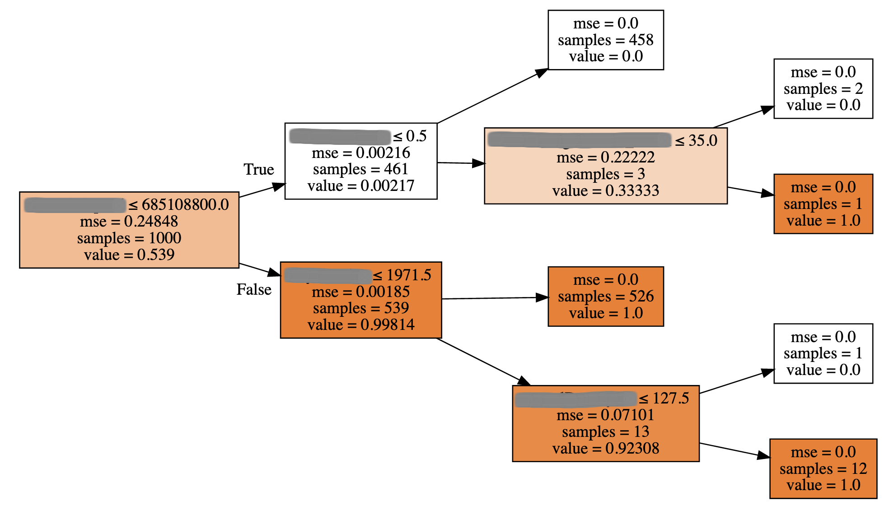
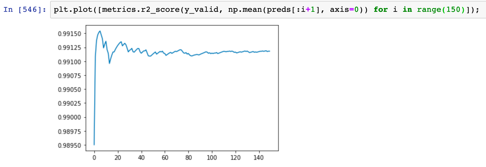
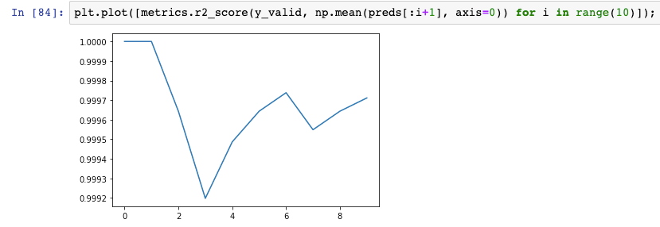

# 100 Days Of Code - Log

### Questions to Answer

- What do I do with date fields that have no values? how do I default them?
- Can I visually represent a decision tree as a graph? I want to understand why averaging values at the other leaf nodes across multiple trees gives us a better result

### Day 9: September 10, 2019

**Today's Progress**

Another practical day but felt super productive becase I am starting to get a hand of some of the tooling around pre processing the data. Because ML needs numbers for everything, you need to be able to quickly get a dataset in good shape so you can start doing EDA  (Exploritory Data Analysis) on it.

The more I dig I realise that data pre processing is both a very important by time consuming exercise, learning all the enhanced ways to fix that is going to be critical to be able to do some speedy experiments.

Here are a few learnings:

`add_datepart(df_raw, 'date_field_name')` - this is a function from the fastai library and essentually breaks up a date (for all rows) into a heap of different parts like year, month, day, dayofyear, isendofmonth etc, super powerful.

`df_raw.columns` - if you want to look at a pandas (another python library) dataframe's columns

`train_cats(data_frame)` - Another fastai function to change any columns of strings in a panda's dataframe to a column of categorical values

`df_raw.nps = df_raw.nps.fillna(np.nanmean(df_raw.nps))` - this takes a field in a dataframe, looks for `NaN` values and fills them with the `mean` of the column, really useful for quickly filling in missing data.

`RandomForestRegressor(n_estimators=1, max_depth=3, bootstrap=False, n_jobs=-1)` - this command was used to generate the visualisation below of a single, deterministic decision tree. `n_estimators` is how many trees you want it to generate. `max_depth` is how deep do you want the tree to be (in this case its 3 levels). `bootstrap` this turns off and on random columns, in this case it makes our tree deterministic and lastly `n_jobs`, this is for paralellising processing of trees (ie controls how much CPU is used), `-1` defaults to 10 trees at a time.

So after a heap of playing I was able to visualise one of my decision trees:



and also get a much better graph of 1 to 140 tree averages:



**Thoughts:**

As mentioned, data processing looks like it is a massive part of the whole process so having tools that can quickly get data into a useable state, not perfect, so that you can start looking at the data is critical. I felt really productive and am looking forward to learning more ways to speed up the experimentation process.

**Link to work/resources:**

[jupyter notebook cheatsheet PDF](https://www.cheatography.com/weidadeyue/cheat-sheets/jupyter-notebook/pdf/)

### Day 8: September 9, 2019

**Today's Progress**

Today was very much a play day with my own dataset. I have created my own `jupyter notebook` and used the lesson1 notebook from the Intro to ML from fast.ai as a template.

My first run looks like it was abismal, my R<sup>2</sup> result was 1 or 0.99.

Below is a plot from the first 10 of my Random Forests:



What is pretty cool though, is I have it running through all of the transforms and it actually makes it through the Random Forest Regressor process. I am currently making the assumption this is broken as I was expecting a nice curveup towards 1.0, not starting at 1.0. :)

I am also visualising one of the decision trees and it only had 1 binary split which I am not sure why that is, something to continue investigating tomorrow.

**Thoughts:**

I dont have definitive proof yet but I am fairly sure my model is broken the graph doesn't look right and the R<sup>2</sup> is too high. I am pretty happy with where I am at but I suspect I am going to have to watch the lesson 1 and 2 courses again to try and get a better understanding on what I am doing.

**Link to work/resources:**

None

### Day 7: September 8, 2019

**Today's Progress**

As mentioned yesterday, today is a practical day. I spent 30mins setting up home machine to be able to run `jupyter notebook` using my most excellent setup instructions which worked a treat. :)

I have defined what `jupyter notebook` is so here is the definition from there site:

`"The Jupyter Notebook is an open-source web application that allows you to create and share documents that contain live code, equations, visualizations and narrative text."`

It was created (as I understand it) for acedemia to share research including working code. It is incredibly powerful and a very cool way to do exploratory research into your data and document your thinking as you go.

I spent most of the day just working with my own data set, going over what I had learnt in lessons 1 and 2 from the intro to ML course. Most of my time was spent starting the (what now looks like) long process of preprocessing my data getting it ready for the random tree method. I am sure I am doing a heap of things wrong and way too manually but for the moment, it is so I can understand what is going on in the background so progress has been super slow.

I spend a heap of time in `jupyter notebook` so quickly looked up shortcuts and found a good article [here](https://towardsdatascience.com/jypyter-notebook-shortcuts-bf0101a98330).

The ones I have found useful so far:

`shift + enter` - runs a line in the notebook

`option + enter` - runs a line and inserts a new line below

`d, d` - ie press d twice, this deletes the cell you are on in the notebook


If you want to see what a command does, just prepend it with `??` ie `??proc_df` will give you a command man page plus its code. If you just want the man page just use a single `?`.

**Thoughts:**

Super slow progress today, didn't learn anything new, just setup my iMac environment to match that of my laptop, which was good because I found some gaps in my install instructions. I wanted to start to play with data that I know so that I can put things into context. I didn't get anywhere near running my data through the random forest and suspect I have another couple of days before that is the case.

**Link to work/resources:**

None

### Day 6: September 7, 2019

**Today's Progress**

Completed lesson 2 [course](http://course18.fast.ai/lessonsml1/lesson2.html) on intro to machine learning. Incredibly interesting stuff around `Random Forests` and to be honest, I think I need to stop the lessons now and start to have a play. I have some data to work on that is contextual to my work so that is going to be super interesting. Part of this lesson shows ways of how to ploy and visualise both graphs and decision trees and gave some great recommendations on "defaults" for some of the `Hyperparameters` or tuning variables.

Here is a big of a dump of interesting bits of note:

When `Bagging` you can do a couple of sampling methods, `Row` and `Column` sampling:

`Row`

- this takes a random subset of data (in our case with replacement) and creates a tree, it tests binary splits with all features (aka column)

`Column`

- uses a random subset of rows as above
- also introduces the use of a random subset of features when doing the binary splits instead of all features, helps with speed BUT also helps to make each tree less correlated

In this course there is a `Hyperparameter` called `max_features`, what this does is to determine, when doing a binary slip how often it should do a binary split and test all features or select from a random subset of features. So if you set `max_features` to `0.5`, this means when it comes to a binary split, 50% of the time it will use the full feature set and 50% of the time it will take a random subset of features (how many can be configured)

Good values to try for `max_features` is 0.5, 1, log2 and square root (see code documention on how to do that, its in the course).

`out-of-bag` or `OOB` - this is actually really cool, it allows you, for each tree, to automatically create a validation set of data from the rows that werent used in that tree to be used as a validation set. You can then average the those results, the idea being to get close to your R<sup>2</sup> value, ie your prediction, just another way to see if your experiments are headed in the right direction.

`number of estimators` (aka `trees`) - this is another `Hyperparameter` and allows you to set a small number when experiementing but then set large numbers for long running training efforts, another method of speeding up the experimentation process.

`Uncorrelated trees` - are those that give totally different predictions to each other. This is why the average of a bunch of dumb tress is better because the ensumble model (the combination of multiple trees) is likely to generalise (ie predict) better.

`Grid Search`

- allows you to pass in a list of `Hyperparameters`
- pass in a range of values for those `Hyperparameters`
- this enables the model to auto tune itself

`min_samples_leaf`

- this sets how many samples you want left when it gets to the bottom of each tree
- some good values to try 3, 5, 10, 25
- used to speed up the process

**Thoughts:**

**Link to work/resources:**

### Day 5: September 6, 2019

**Today's Progress**

After a massive day (I think it was 6 hours for the day, 1 in the morning before work and 5 after work) today was a little slower, just an hour.

I continued working through the fast.ai [course](http://course18.fast.ai/lessonsml1/lesson2.html), lesson 2 Random forest deep dive. The lecturer who presents the material is awesome, engaging and a really smart dude. :)

`Random forest` decision trees seem incredibly powerful, I definitely dont fully understand it yet but the power to quick ascertain relationships in data is incredible and the ability to visualise it is also super exciting and I can't wait to have a play with it. Apparently they do help with overfitting which seems to be a fairly big issue.

Below are some random notes I took of some interesting concepts:

Before getting carried away and recreating the wheel, when you have an idea of something you want to model make sure you google it first. I have had a few people let me to, google “[problem name] Kaggle example”. [Kaggle](https://www.kaggle.com/) is a really interesting site where people put up interesting data problems that have attached with them a cash prize. The cool thing about it is, you can participate in a kaggle contest even after it has finished AND you can  get rated on the leaderboard. It seems like am amazing place to measure your ML foo.

`EDA` - Exploritory Data Analysis

`mse` - mean squared error is a risk function. It takes all of the mean squares of the distace between data points and the "fit" line then takes the mean. The smaller this number is for a model, the closer your data "fits" your model. The average of X random forest mse's is 0 so what is left is the true relationship. This is important as it means when we use many random forests, we are likely going to get a much better "fit" with overfitting minimised.

`Bagging` or `Bootstrap Aggregating` - this concept is where you take your training data set N, take a random sample of X records (ensure X < N) ie "bag" them, and run your random forest over it, you then create Y number of "bags" to get different models. If you take the average of the results of the Y number of models, you are likely to get a better "fit" for your validation data. You may hear the statement "with replacement", what this means is the random sample is always completely random, so in 1 "bag" you could actually get the same data point selected, this is why it is good to have a sizable dataset.

Generally speaking it is a good idea to use 60% of your dataset for training and leave 40% for validation/testing. This 40% can also be broken into a few sets of data, you "hold back" a set or two right to the end to truly test if your model is predicting the outcomes as you have designed it, Kaggle call this a private validation dataset and is used to minimise overfitting of a model.

**Thoughts:**

I feel like I didn't make it through enough today which is a little frustrating because I think I am so close to being about to start cleaning and pre prossessing my project data. I had a great chat with a mentor in the ML space who gave me some really good starting points for my project which I am looking forward to digging into

**Link to work/resources:**

None

http://course18.fast.ai/lessonsml1/lesson2.html

### Day 4: September 5, 2019

**Today's Progress**

After an awesome video call with a Data Engineer in Canberra today, he inspired me just to dive in and leave the theory for when I need it, though the last few days has been really interesting.

His suggestion was to start with the [Intro to Machine Learning](http://course18.fast.ai/lessonsml1/lesson1.html) course.

For this to be useful you need to get the tooling up and running. I have used AWS' Sagemaker before so am semi familar with it. I am on a Mac so the following will be Mac instructions.

Here are the instructions I sort of followed to setup my environment [https://forums.fast.ai/t/wiki-thread-lesson-1/6825]()

Here are the high level bits:

Install conda for python env management
https://www.anaconda.com/distribution/

```
git clone https://github.com/fastai/fastai
cd fastai
conda create -n fastai python=3.6 anaconda
conda env update
conda activate fastai
```

Once you are able to do that, you should be able to run `jupyter notebook`. `jupyter` is like an editor where you put python code, load in your data and start manipulating, traning and validating your module. A browser will open up and you should be able to be able to browse to the fastai directory.

The data for lesson one can be found [here](https://www.kaggle.com/c/bluebook-for-bulldozers/data), click the `Download All` button, that will download a .zip file which contains a bunch of files, find Train.zip and unzip it, the Train.csv is what you will need for lesson 1.

Go to `fastai/courses/ml1` and open up `lesson1-rf.ipynb`. You should be able to then run the python code though there will be errors.

Follow [this](https://medium.com/@GuruAtWork/fast-ai-lesson-1-7fc38e978d37) article and it will sort it.

Here are the commands from the above article you need to run, I suggest reading it anyway incase you already have some of the steps installed already:

UPDATE: I found I had some symlink issues so I had to do the following to get it working on one of my macs, happy for someone to give me a better solution but this worked.

`ln -s /Users/justinhennessy/anaconda3/envs/fastai/bin/pip /Users/justinhennessy/anaconda3/envs/fastai/bin/pip3.6`

`conda list | grep bcolz`
if ^ returns nothing run `conda install -c anaconda bcolz`

```
conda update -n base conda
pip install opencv-python
pip install graphviz
pip install sklearn_pandas
pip install isoweek
pip install pandas_summary
pip install torchtext
pip install feather-format 
pip install jupyter_contrib_nbextensions
pip install plotnine 
pip install docrepr
pip install awscli
pip install kaggle-cli
pip install pdpbox
pip install seaborn
```

So I am super stoke because I went through the first lesson and was able to load in and display (in raw format) my own dataset, the one that I may use for my project! So heaps of progress today.

**Thoughts:**

After a number of conversations this week it has been made really clear to me that I just need to jump head first in, go deep and try and figure it out, trial and error. I am pretty happy that only after 4 days I am starting to use the tooling on my own data. You never know, I may have a v1 model done in another couple of weeks which would be amazing.

**Link to work/resources:**

None

### Day 3: September 4, 2019

**Today's Progress**

Right, yet another day on supervised learning, the rabbit hole is very deep! So I started the day thinking, I will just learn about `Linear Regression`, how hard can that be? Well, to get through the first part I had to learn a bunch of other concepts. Today's session was "heavy" but super interesting, I am starting to see some great uses for comparing data and determining if there are any significant relationships between data.

Here is a little summary of today's learnings:

`Bias` - Sum of Squares, which is the sum of the distance from each data point to a line gives you a approximation of how closely the plotted data "fits" the line. Straight lines have a high `Bias` and low `Variance` while "squiggly" lines (a line that might perfectly fit the plotteddata) has a low `Bias` and high `Variance`.

`"fit"` - is how well a line "fits" the plotted data.

`Variance` - in relation to a "fit" (line), the difference between training and testing data sets is called variance, meaning does my "fit" accurately (enough) match the testing data, ie has it learnt

A good ML model has a low bias and low low variability.

`R` - helps to correlate if there is a strong relationship between quantitative variables

R<sup>2</sup> - similar to `R` but easier to interpret and is the % of variation explained by the relationship between 2 variables (ie mouse size and weight)

`p-value` - is the probability that a random chance generated the data, or something else that is equal or rarer occured. This is used to help determine if R<sup>2</sup> shows a relationship that is of significance

I have pages and pages of notes, equations etc which I wont bore you with, the linked videos were very interesting, I just love the StatsQuest channel. :)

**Thoughts:**

I have again spent a day on maths but it has been really good, I have a "todo" list I am working through so cover all the main math concepts so I can understand it when I get to the Python side of things. I am super keen to get some real data and start playing but am being patient, get the foundations down then we can start to play! :)

**Link to work/resources:**

[Bias and Variance](https://youtu.be/EuBBz3bI-aA)

[Fitting a line to data, aka least squares, aka linear regression](https://www.youtube.com/watch?v=PaFPbb66DxQ)

[R-squared explained](https://www.youtube.com/watch?v=2AQKmw14mHM)

[p-values clearly explain](https://www.youtube.com/watch?v=5Z9OIYA8He8)

[Linear Models Part 1: Linear Regression](https://www.youtube.com/watch?v=nk2CQITm_eo&feature=youtu.be)


### Day 2: September 3, 2019

**Today's Progress**

Wow, today has been slow going, I wanted to get through at a relatively high level `Unsupervised Learning` and `Deep Learning`, only managed to get through `Unsupervised`.

`Unsupervised Learning` helps us fine previously unknown patterns in a dataset without needing a label. There are a couple of main methods that are used to do this, `Principle Component Analysis` and `K-mean Clustering`.

`Principle Component Analysis` (PCA) is a `Dimensionality Reduction` technique that helps find the most relevant features (ie variables, attributes) in a dataset. `Dimentionality Reduction` is discovering non-linear, non-local relationships in data. PCA transforms variables into a new set of variables which are a linear combination of the original variables which assists in clustering data.

`K-mean Clustering` is one of the most popular clustering techniques, grouping similar data points together. `K` being the defined number of clusters you are looking for. This method works through the data points figuring out the smallest amount of distance variance between data points to determine the right number for `K` ie number of clusters.

**Thoughts:**

Tough day today after a long day at work which started at 6am. I think I have decided to change tact. I am super keen to understand all the math under the hood but after tonight I simply dont have the maths chops yet, there is a huge amount of ground work I need to do before I can dive too deep.

So on that I will start looking at Python courses to start playing with data as soon as I can. I figure if I can get something practical up and running and use the results from the maths functions and get a good grasp of their uses then that might help me understand it better.


Youtube channels:

[Siraj Raval](https://www.youtube.com/channel/UCWN3xxRkmTPmbKwht9FuE5A) <- this guy is amusing to watch and really entertaining, makes complex seem easier

[3Blue1Brown](https://www.youtube.com/channel/UCYO_jab_esuFRV4b17AJtAw) <- only watched one video but looks like has heaps of math knowledge ill come back to

[StatQuest with Josh Starmer](https://www.youtube.com/channel/UCtYLUTtgS3k1Fg4y5tAhLbw) <- another entertaining smart dude, maths knowledge


### Day 1: September 2, 2019

**Today's Progress**

My first day has begun with research and I suspect the first week or 2 is going to be the same.

I have been working my way through the [Machine learning for humans](https://medium.com/machine-learning-for-humans/why-machine-learning-matters-6164faf1df12) blog post (I downloaded the PDF). As I am a complete noob, I wanted to get across all the different types of learning. Today was all about supervised learning, here are some tid bits.

There are two main tasks for supervised learning:

- regression (ie how much will a house sell for)
- categorisation (ie cat or dog)

Under the umbrealla of regression there are a few methods

`linear regressions` (ordinary least square, OLS), predict a continuous numerical value, tries and predicts a value Y given a previous unseen value of X. Within this topic there was discussion of `Gradient Descent`, the goal of which is to find the minimum of a model’s loss function by iteratively getting a better and better approximation of it. Machine learning libraries like scikit-learn and TensorFlow use it in the background everywhere, so it’s worth understanding the details.


`logistic regression` a method of classification which outputs the probability of a target Y belonging to a certain class

It also discussed a concept of `overfitting`, which essentially means, the model matches the training data exactly so losses its ability to "predict" or learning for things it hasn't seen.

Two ways to combat overfitting:

1. Use more training data. The more you have, the harder it is to overfit.

2. Use regularization. Add in a penalty in the loss function for building a model.

**Thoughts:**

I have decided to take up the 100 day of coding challenge with a focus on Machine Learning.

From a very early age, AI and Machine Learning has been a fascination and something I thought would only ever be a thing of fantasy. With the barrier to entry being so low now and with an abundance of tooling to help not only learn but execute, the time is ripe.

I would like to thank Daniel Bourke and Angela Baltes (part of my Linkedin network) for their guidance and patience to help me at the very beginning of my journey, this humble student appreciates the time you have given to help me on this journey to date.

So a challenge is not one without a goal, so here goes, I am committing that in 100 days, I will have built my first custom learning model and have run a real-world experiment with it.

I have some ideas on where I might start to give myself a little more focus but I will vet these ideas first, then commit to a particular use case in the coming weeks.

**Link to work:**

[Learning how to Learn](https://www.coursera.org/learn/learning-how-to-learn?utm_term=danielbourke_learning-how-to-learn_jan2019&ranMID=40328&ranEAID=EBOQAYvGY4A&ranSiteID=EBOQAYvGY4A-EE5LayT1JI2.Iaxai1d69g&siteID=EBOQAYvGY4A-EE5LayT1JI2.Iaxai1d69g&utm_content=10&utm_medium=partners&utm_source=linkshare&utm_campaign=EBOQAYvGY4A)

[Machine learning for humans](https://medium.com/machine-learning-for-humans/why-machine-learning-matters-6164faf1df12)


