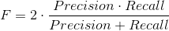
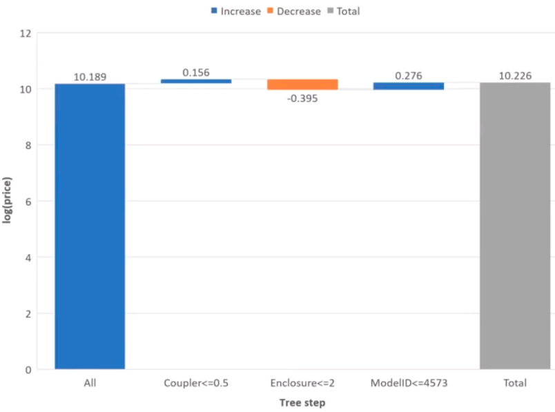
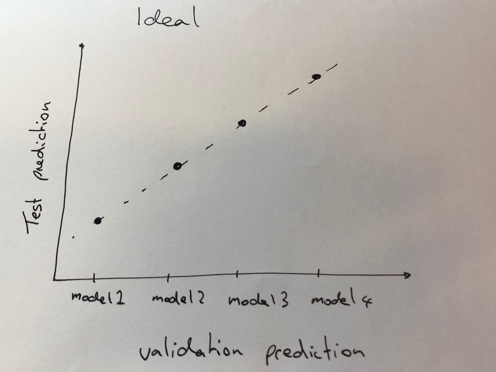
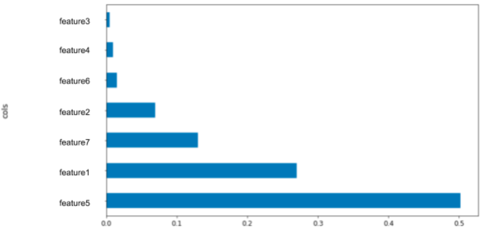
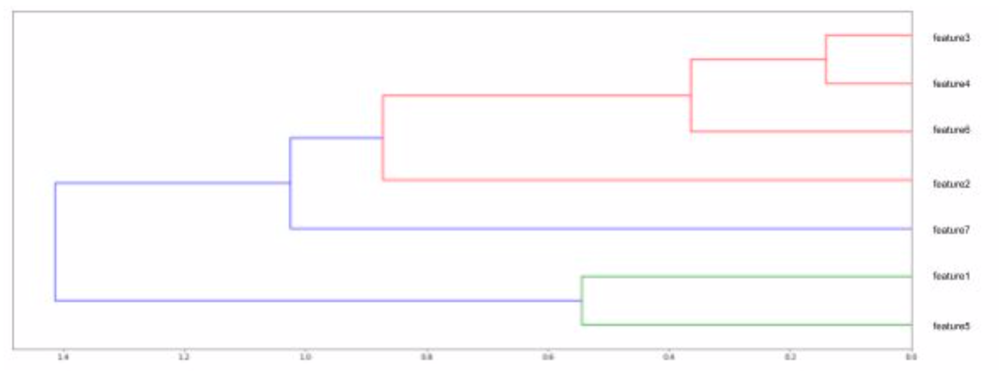

# 100 Days Of Code - Log

### Questions to Answer

- What do I do with date fields that have no values? how do I default them?
- Can I visually represent a decision tree as a graph? I want to understand why averaging values at the other leaf nodes across multiple trees gives us a better result
- How can I feed in new data into a model and it show me the results per row?
- Why should I use the log of a value instead of the actual value when training and compariing data (ie like sale price)
- What is Rank correlation? and what is monotonic data?
- What is a univariate relationships?

### Day 22: September 23, 2019

**Today's Progress**

Did another deep dive into data pre processing, working on levelling up my python and pandas fu. Here are a number of things I learnt was super useful:

`df_raw.shape` - this outputs the "shape" of the dataframe `(5889, 37)`, the number of rows and the number of columns.

This is a way to get a diff of 2 arrays, it returns the elements that are different (in an array):

```
list(set(df_raw.plans.unique()) - set(df_raw.plan.unique()))
```

Here is a way to remove rows that have a column with NaN in them:

```
df_raw = df_raw[~pd.isnull(df_raw.plan)]
```

Here is a way to replace a value across a subset of data then cast its type:

```
df_raw[case_type] = df_raw[case_type].fillna(df_raw[case_type].mean()).astype(int)
```

This is really useful for defaulting numeric values that as missing and that will have little impact on the dependant variable, as everything moves toward the `mean`, over an entire dataset.

Here is a good way to get a unique list from a category feature, at the same time filtering out any `NaN`:

```
df_raw.category_field[~pd.isnull(df_raw.category_field)].unique()
```

Say this was a plan type, it means you can use this list to iterate through your dataset and set some default for a subset of data ie use in conjuction with the example above.

Another really useful technique I discovered was "binning", here is some sample code:

```
bins = [1, 3, 7, 14, 30, 60]
group_names = ['day', 'few_days', 'week', 'fortnight', 'month']

last_login_categories = pd.cut(df_raw['last_login_days'], bins, labels=group_names)
df_raw['last_login_categories'] = pd.cut(df_raw['last_login_days'], bins, labels=group_names)
last_login_categories
pd.value_counts(df_raw['last_login_categories'])
```

So, say you have a numberic field that you want to group the data and do a bit of feature engineering, these groups are called "bins". The bins are defined by the `bins` array, which tells pandas what to do when it is doing the `.cut` action. In the above example we are taking a field called `last_login_days` which may represent the number of days since a customer has logged in. We may be interested, depended on the type of customer, to be notified if a small customer for instance hasn't logged in for a `week`. This technique enables us to be a little more descriptive about this behavour and may help develop some insight and correclation we didn't know about previously.

Today triggered me to start looking for more general data science courses, the Pluralsight link below was a high overview of the data science industry but was a good introduction. I will be looking for more of this over the coming days because the power it gives to visualise insights into data is very exciting.

**Thoughts:**

None.

**Link to work/resources:**

[Pluralsight - Data Science: The Big Picture](https://app.pluralsight.com/course-player?clipId=5d6375af-e24e-4837-81df-b8be7ed272b0)

[Pandas Dataframes](https://www.shanelynn.ie/using-pandas-dataframe-creating-editing-viewing-data-in-python/)

### Day 21: September 22, 2019

**Today's Progress**

Another very practical day, after reading an article on "Transformation for Machine Learning, a Beginners Guide" I created this [data analysis template](https://gist.github.com/justinhennessy/48b1c9631014d176b34196bbef3fea27) which I can see will start to be very useful when I start looking at a new set of data. It shows you the types of data you are looking at (int, string, object etc). It also visualises all of the numberic values so you can see what the distribution is of them which may give you a hint as to how to pre process them.

I also gained a better understanding of how datasets are broken up into training and validation sets. Also gained more understanding of how python pandas dataframes work.

**Thoughts:**

None.

**Link to work/resources:**

[Feature Transformation for Machine Learning, a Beginners Guide](https://medium.com/vickdata/four-feature-types-and-how-to-transform-them-for-machine-learning-8693e1c24e80)

### Day 20: September 21, 2019

**Today's Progress**

Another mix of practice and finishing [lesson 7](http://course18.fast.ai/lessonsml1/lesson7.html). I think I am going to shelve the fastai course for a bit and try and use what I have learnt. There has been a heap and I still need to try and get something useful up and running.

Below are some other random bits I found interesting.

`%timeit` - outputs some details about small snippets of code, why I thought this was interesting is because it shows you how long each loop took so can help with optimisation down the track. Here is some sample output: `3.43 µs ± 76.8 ns per loop (mean ± std. dev. of 7 runs, 100000 loops each)`

Discover an extension plugin for `jupyter notebook`, nbextensions, here is how to install it:

```
pip install jupyter_contrib_nbextensions && jupyter contrib nbextension install
```

When you relaunch `jupyter notebook` you will have a new tab, `Nbextensions`. The first one to turn on is `Collapsible Headings`. The second one is `Gist-it`. If you are unfamiliar with gist, it is just a way to share snippets of code, information etc. In this instance it enables you to publish your whole notebook if you wanted someone to take a look at what you were to up.

`Gist-it` setup:

Go to `https://github.com/settings/tokens` and generate a personal token, it just needs `gist` permissions so just tick that box and generate it. This requires you have a github account, if you haven't got one of those then create one.

Then go into `jupyter notebook` and click on the `Gist-it` item in the list and a set of documentation will appear below. All you need to do is paste the token you generated into the blank box under `Parameters`.

In your notebooks you will now have a button that looks like an outline of a cats head, click that and it will pubish it to [gist](https://gist.github.com/).

`Cython` - this is an extension you can use to speed up your code. It essentially takes your python code and compiles it into C

`alpha=0.05` - this is a param when you are using plots, it just means that if you have a heap of data points sitting on top of each other, it takes points that occur less and makes them more opaque

Python has a tenary operator which I have found helpful in other languages:

```
x = <condition> ? do_something1 : do_something2
```

An interesting observations:

Training with unblanced datasets (where your dependant case doesn't appear much), use over smapling of the uncommon cases until they are about the same as the common number, ie duplicate them. This heaps bootstraping to ensure training and validation sets have similar types of data.

Information gain, try and have a very low standard diviation between branches on a logical split.

SVM, a method of modelling, isn't used as much these days, it is more theoretical

If there are any less than 22 of any one class then the dataset is considered unstable. This has something to do with T distribution which I will need to look into as I am not sure why this is.

### Day 19: September 20, 2019

**Today's Progress**

Today was very much a practical day. I have started to try and gather more data to enrich my project dataset. I was very successful and added a few more facets to it. I also successfully loaded it into my `jupyter notebook` and was able to start to tease out some more understanding on how all the features interact with each other.

Not that I really know what feature engineering is yet, I feel like I embarked on my first attempt of this, creating columns of data from raw data outputs from a few systems. It is really interesting to try and build a clear view of the outcome then build features which might help give you more insight, very cool. :)

I still dont have enough confidence to actually get my model working and be sure it is useful. One thing I did get across yesterday was the `f1_score`. To calculate an `f1_score` (or harmonic mean) the following formula is used:



`Precision` is out of all the samples the classifier identified as postive (ie it was SPAM or it was cancer), what proportion did your model get correct?

`Recall` is out of all the samples the classifier identified how many did it pick up?

So for example, if your dataset had 7 emails that were SPAM and your classifier (ie model) identifies 3 of them and nothing else (ie NON SPAM) then your model has a high `Precision` but because there were 7 total that it should have picked up, your model has a low `Recall` . The key is to try and get both `Precision` and `Recall` as high as possible, this is what the `f1_score` gives us, a way to see how well we are doing.

**Thoughts:**

None.

**Link to work/resources:**

[What is an f1_score](https://www.youtube.com/watch?v=Z9NZY3ej9yY)
[Equation GIF builder](https://www.codecogs.com/latex/eqneditor.php)

### Day 18: September 19, 2019

**Today's Progress**

Continued my way throught the fastai [lesson 5 - Extrapolation and Random Forest from scratch](http://course18.fast.ai/lessonsml1/lesson5.html) and [lesson 6 - Data products and living code](http://course18.fast.ai/lessonsml1/lesson6.html). There was not a heap of new things just more discussion about what had already been covered from lessons 1-5, which was good to get a few more views on what it was we were looking to do and why we were doing it.

In lesson 6, the lecturer mentioned an article he wrote around [Designing great data products](https://www.oreilly.com/radar/drivetrain-approach-data-products/) which covered his method of developing and working with data, super interesting.

Today was has also been very much about levelling up my Python Fu. Below is just some random bits and pieces which I found useful.

List comprehension
This was a little technique I thought was useful in Python, just a nicer/leaner way to achieve the same outcome.

Usually you might have an array that you want to perform an action on each element, like so:

```
squares = []

for x in range(10):
    squares.append(x**2)
```
    
with List Comprehension, this can be achieve more simply:

```
squares2 = [x**2 for x in range(10)]
```

Another interesting command was:

```
np.random.permutation(10)
```

This returns a array of randomised numbers:

```
array([9, 6, 5, 4, 0, 1, 8, 7, 3, 2])
```

This is a great way to get a randomised set of data from a pandas dataframe using the random list as random array index ids.

Displaying a row of data in your dataframe, this is done by using pandas `.iloc` method. Here is an example if I wanted to see the first record in my dataframe:

`df_raw.iloc[0]`

If I wanted the last record I could do this:

`df_raw.iloc[len(df_raw)-1]`

`.iloc` also has a second parameter to retrieve the column:

`df_raw.iloc[0,0]`

This will display the first field, from the first row. Being able to access this data using indexes is something I can see being very powerful in the future.

**Thoughts:**

None.

**Link to work/resources:**

None.

### Day 17: September 18, 2019

**Today's Progress**

Not too much progress today, just wiping a little egg off the face as I realised I was using the completely wrong approach for my side project! I have not issue declaring it because this is why I am here, to learn. :)

So I have discovered it doesn't matter too much what method you need to use (ie Regression or Classification), a heap of steps are the same which is hugely encouraging. I feel really confident now on the pre-processing side of things, obviously I have a huge way to go but I understand the intent of what we are trying to do in that phase.

I have rerun all my data using a RandomForestClassifier, which has new "scores" I need to get across ie f1 and accuracy, and currently the model is too accurate. "Data Leakage" seems to be a pretty systemic problem I have had so far, something I need to dig into more.

**Thoughts:**

None.

**Link to work/resources:**

None.

### Day 16: September 17, 2019

**Today's Progress**

Continued through [lesson 5](http://course18.fast.ai/lessonsml1/lesson5.html) on Extrapolation. There is an interesting concepted called a tree interpreter which shows you the +/- delta a feature has on the prediction. When coupled with a waterfall plot:


(example from the fastai course)

This can give us a good idea as to what impact each feature has on the predicted outcome of the dependant variable.

There was also discussion around if you have a big difference between your validation and OOB scores, this often being that you need to handle temporal data better, ie be mindful of past, current and future dates in the context of predicting your dependant variable. I haven't got a method to mitigate that yet but it is something I will now take into consideration when looking at my different data sets.

There was also a plotting method mentioned that compared the results from of 5 models using your validation and test sets, you then plot those results (ie predictions of the dependant variable), test set on the Y axis and validation on the X:



The idea being you are looking to try and show a linear relationship, this gives good indications that your model is able to generalise well.

Some good advise from the lecturer, better to find out if your model(s) generalise in testing rather than production when they can have real world impact, very sound advise I think. :) I will give this method a try at some point as it looks really useful.

**Thoughts:**

None.

**Link to work/resources:**

None.

### Day 15: September 16, 2019

**Today's Progress**

Pretty slow day, finalised [lesson 4](http://course18.fast.ai/lessonsml1/lesson4.html) on feature important and started watching [lesson 5](http://course18.fast.ai/lessonsml1/lesson5.html) on Extrapolation. Nothing of note today.

One thing I did learn was around Cross Validation.

Cross validation is not so good with temporal data (ie things with time in it) and according to the fastai people you should use it sparingly.

Method:

 - this randomly shuffles your data and splits it into X number of groups

- for the first model, it takes the first group of data as a validation set and the rest as a training set

- for the second model, it takes the second group of data as a validation set and then rest as training

- this continues until you have X number of models

- it then takes the averages of the results and this gives you a prediction of your dependant variable you can "cross reference" with you test set (the dataset you leave until last to confirm your model generalises ok)

**Thoughts:**

None.

**Link to work/resources:**

None.

### Day 14: September 15, 2019

**Today's Progress**

Contiued working through the [fast.ai](http://course18.fast.ai/lessonsml1/lesson4.html) lesson 4 course on feature importance. The focus was on more tooling to help visualise and validate the relationships between features (ie columns).

I have put my own project on hold for the moment as I am not sure how to proceed. Luckily I have access to a very generous person who is going to have a look at what I have done to date. My current suspection is that my dataset is suffering some "data leakage", information that is added after the fact that is creating a very strong correlation with my dependant variable which is masking any further insight. Rather than stumbling blindly for another week I thought I would get some experienced eyes across it.

I have also started reading the [100 page machine learning book](https://www.amazon.com.au/Hundred-Page-Machine-Learning-Book/dp/199957950X/) which was recommended by [Daniel Bourke](https://www.linkedin.com/in/mrdbourke/). Daniel's philosophy is to ensure you are reading "hard" books, you may not get them straight away but it extends your brain and thinking and eventually you will get across it. This is definitely one of those books as there is a heap of maths outlined which I have never seen before but interestingly through my 14 days of learning have started to see some of the concepts appear so getting more details on how things work is great.

**Thoughts:**

I lost a bit of momentum on my own project because I was unsure how to proceed and felt I was wasting my time. Luckily I had been build a network of ML and Data Sceience people over the last few months so have quite a few people I can reach out to.

**Link to work/resources:**

None.

### Day 13: September 14, 2019

**Today's Progress**

Today's journey started on the path of learning about feature importance, something that looks very exciting, more because it looks like it will start to give me tools to validate what I am seeing through my model. The biggest issue at the moment is I am not sure what I am looking at, my model says I am 90% accurate but of what?! and is that try. The dataset that I am work on is very small so I think that is part of the issue. I still haven't got a feel for what a good sized training and validation set looks like. There are some techniques for small sets that I haven't employed yet, that is tomorrows job.

So, feature importance begins to show us which features (ie columns) have the most impact on the result. Below is an example of a plot which shows how that looks:



Another cool visualisation is a dendrogram, which is essentially a tree diagram showing relationships between features:



I suspect like data pre-processing, I am going to need a few days on this to try and get as much useful info out with the view to validating my model.

**Thoughts:**

I am still struggling with understanding what I am seeing, it is easy to copy and paste code from the lessons and get something out but its a whole another world to understand what I am looking at. This will be my task over the next week, try and get to a point where I am confident with what I am looking at.

**Link to work/resources:**

None.

### Day 12: September 13, 2019

**Today's Progress**

I started on lesson 4 today, feature importance and tree interpreter, and I suspect I am going to need quite a few days to use what is in this lesson.

Here are some random things I noted:

When removing redundant columns, you may remove columns that have collinear relationships. 

[Collinearity](https://youtu.be/-2N5aCawArM) - two columns related to each other. Removing columns that have co will not make your tree any less predictive. If you have columns related to each other, they can share importance, once removed it often clears up your importance graph.

The depth of a decision tree can be calculated (assuming the final level has leaves with 1 sample in them): log2(n), n = number of samples

The last level of the tree will have n leaves, so the smaller the sample the less decisions can be made, less rich for predictions, smaller samples overfit less but is overall less accurate, less binary choices.

Two things you want to do when building a model using bagging, each tree/estimator as accurate as possible, across the estimators the correlation is as low as possible, so that when you average things out you get good generalisation. Smaller samples decreases the power of the estimator and increasing the correlation.

There are 2 reasons why your validation score (or mean square error) are terrible. If your overfitting, the r2 score of the OOB dataset will get worse.

If your sample size is small and you can’t use OOB, create another random validation set. 

If OOB or your random validation set gets worse, you must be overfitting.

Second reason, if there is a huge change of attributes or behaviour between training and validation that could explain bad validation results.

`one hot encoding` - when changing categories into codes, you can just change each string value to a number, one hot encoding splits each category into its own column which has a value or 1 or 0. It might improve discovering correlation between it and other fields. Used for columns that has small number of unique values. Use `max_n_cat=x` when using proc_df to automatically split columns into separate Boolean “is_category name”, x is the number over which it will not do this, x being the unique category count in a field.

“Levels” in a category column can also be referred to as cardinality, or number of unique values.

Some recommendations on tuning the Random Forest Regressor:

max_features=0.5 to get more varied trees, 50% of the time it will choose a random field for the next decision point

min_samples_leaf=1,3,5,10 etc until result gets worse.

**Thoughts:**

**Link to work/resources:**

### Day 11: September 12, 2019

**Today's Progress**

I was lucky enough to have a flight today which gave me a good 2 hours to continue watching the lessons I have been going through on [fast.ai](http://course18.fast.ai/lessonsml1/lesson3.html), lesson three was about Performance, Validation and Model interpretation.

It started with talking about how to experiment with large dataset and how to make those tests very fast using different ways to load in the data, for example secificying the type of each field so that pandas `read_csv` method doesn't need to figure out itself, you can load in millions of rows in just a few seconds using this technique.

There was discussion on how to start getting some better insights into what the data is you are initially working with. Using `df.describe(include='all')` you can understand, especially when you are working wtih time, what period your datasets are both for training and validation. There was recommendation that when you are working with lots of data, try working with recent data because conditions may have changed historically for price for instance.

There have been a couple of times now where they have recommended using the log() of a value to training and validate, especially around things like price. From what I understand, this is to "smooth" out any outliers but I will need to do some more investigation about that. With the numpy library you can do np.log1p() which does the log plus one, this is to ensure there are no negative values, in the lessons example he also used a `.clip` method to "truncate" values from 0, again I will have to have a play with that, here is the full command: `np.log1p(np.clip(df.unit_sales, 0, None))`.

**Thoughts:**

I now feel quite confident with the pre-processing of data, well to have a good crack at it anyway. The thing I need now is to start interpreting the results I am getting from the data I am working with. Lesson three had some really good methods to start doing that. Lesson 4 looks like it will have even more, around feature importance which looks to be a really good way to build confidence in the results the models I am creating.

**Link to work/resources:**

None

### Day 10: September 11, 2019

**Today's Progress**

Another "slow" day, I suspect the pre processing and fiddling is going to be happening for quite a few days. I am continuing to build up my own dataset and getting use to all the different tools to prepare the data to be run through the Random Forest Regressor.

Here are some random things I learnt through the day:

When creating a model, allocate 3 types of data:

- Training
- Validation
- Test

The key is to keep the Test dataset unseen until you think you are finished your model, this is to ensure you dont overfit the data which can happen to validation data.

`df[df.is_suspended > 0]` - if you want to output certain values from a dataframe field

`df_raw.describe(include='all')` - this gives you some aggregated information about your data. `first`/`last` shows you the oldest and newest for dates, this means you can compare dates between your training, validation and test datasets. It also gives you the mean and percentiles for numeric values.

When experimenting, use recent data in your dataset.

When using `train_cats` (a function to create numeric values for category fields), to ensure that you use the same categories across your training and validation sets, use `apply_cats(validation_set, training_set)`.

`%prun` - put this in front of any command and it will profile the command and show you where all the time is being spent, helps identify slow parts
 
 `df_raw.sort_values(by=['field_name'])` - this is how you sort rows in a dataframe by a particular field.

`out-of-bag` - is used to create validation sets on the flu, it users rows that were not used to train a tree. This is good for small datasets.

If the standard diviation of the average between trees is high, this means the `mean` (ie "predictions") are further apart from each other.

`bootstrape=false` - this is a parameter you can pass into the RandomForestRegressor function, it turns of randomly select fields to split, it makes it deterministic.

When dealing with time data, try and make your training and test datasets from different periods.

### Day 9: September 10, 2019

**Today's Progress**

Another practical day but felt super productive becase I am starting to get a hand of some of the tooling around pre processing the data. Because ML needs numbers for everything, you need to be able to quickly get a dataset in good shape so you can start doing EDA  (Exploritory Data Analysis) on it.

The more I dig I realise that data pre processing is both a very important by time consuming exercise, learning all the enhanced ways to fix that is going to be critical to be able to do some speedy experiments.

Here are a few learnings:

`add_datepart(df_raw, 'date_field_name')` - this is a function from the fastai library and essentually breaks up a date (for all rows) into a heap of different parts like year, month, day, dayofyear, isendofmonth etc, super powerful.

`df_raw.columns` - if you want to look at a pandas (another python library) dataframe's columns

`train_cats(data_frame)` - Another fastai function to change any columns of strings in a panda's dataframe to a column of categorical values

`df_raw.nps = df_raw.nps.fillna(np.nanmean(df_raw.nps))` - this takes a field in a dataframe, looks for `NaN` values and fills them with the `mean` of the column, really useful for quickly filling in missing data.

`RandomForestRegressor(n_estimators=1, max_depth=3, bootstrap=False, n_jobs=-1)` - this command was used to generate the visualisation below of a single, deterministic decision tree. `n_estimators` is how many trees you want it to generate. `max_depth` is how deep do you want the tree to be (in this case its 3 levels). `bootstrap` this turns off and on random columns, in this case it makes our tree deterministic and lastly `n_jobs`, this is for paralellising processing of trees (ie controls how much CPU is used), `-1` defaults to 10 trees at a time.

So after a heap of playing I was able to visualise one of my decision trees:


and also get a much better graph of 1 to 140 tree averages:


**Thoughts:**

As mentioned, data processing looks like it is a massive part of the whole process so having tools that can quickly get data into a useable state, not perfect, so that you can start looking at the data is critical. I felt really productive and am looking forward to learning more ways to speed up the experimentation process.

**Link to work/resources:**

[jupyter notebook cheatsheet PDF](https://www.cheatography.com/weidadeyue/cheat-sheets/jupyter-notebook/pdf/)

### Day 8: September 9, 2019

**Today's Progress**

Today was very much a play day with my own dataset. I have created my own `jupyter notebook` and used the lesson1 notebook from the Intro to ML from fast.ai as a template.

My first run looks like it was abismal, my R<sup>2</sup> result was 1 or 0.99.

Below is a plot from the first 10 of my Random Forests:


What is pretty cool though, is I have it running through all of the transforms and it actually makes it through the Random Forest Regressor process. I am currently making the assumption this is broken as I was expecting a nice curveup towards 1.0, not starting at 1.0. :)

I am also visualising one of the decision trees and it only had 1 binary split which I am not sure why that is, something to continue investigating tomorrow.

**Thoughts:**

I dont have definitive proof yet but I am fairly sure my model is broken the graph doesn't look right and the R<sup>2</sup> is too high. I am pretty happy with where I am at but I suspect I am going to have to watch the lesson 1 and 2 courses again to try and get a better understanding on what I am doing.

**Link to work/resources:**

None

### Day 7: September 8, 2019

**Today's Progress**

As mentioned yesterday, today is a practical day. I spent 30mins setting up home machine to be able to run `jupyter notebook` using my most excellent setup instructions which worked a treat. :)

I have defined what `jupyter notebook` is so here is the definition from there site:

`"The Jupyter Notebook is an open-source web application that allows you to create and share documents that contain live code, equations, visualizations and narrative text."`

It was created (as I understand it) for acedemia to share research including working code. It is incredibly powerful and a very cool way to do exploratory research into your data and document your thinking as you go.

I spent most of the day just working with my own data set, going over what I had learnt in lessons 1 and 2 from the intro to ML course. Most of my time was spent starting the (what now looks like) long process of preprocessing my data getting it ready for the random tree method. I am sure I am doing a heap of things wrong and way too manually but for the moment, it is so I can understand what is going on in the background so progress has been super slow.

I spend a heap of time in `jupyter notebook` so quickly looked up shortcuts and found a good article [here](https://towardsdatascience.com/jypyter-notebook-shortcuts-bf0101a98330).

The ones I have found useful so far:

`shift + enter` - runs a line in the notebook

`option + enter` - runs a line and inserts a new line below

`d, d` - ie press d twice, this deletes the cell you are on in the notebook


If you want to see what a command does, just prepend it with `??` ie `??proc_df` will give you a command man page plus its code. If you just want the man page just use a single `?`.

**Thoughts:**

Super slow progress today, didn't learn anything new, just setup my iMac environment to match that of my laptop, which was good because I found some gaps in my install instructions. I wanted to start to play with data that I know so that I can put things into context. I didn't get anywhere near running my data through the random forest and suspect I have another couple of days before that is the case.

**Link to work/resources:**

None

### Day 6: September 7, 2019

**Today's Progress**

Completed lesson 2 [course](http://course18.fast.ai/lessonsml1/lesson2.html) on intro to machine learning. Incredibly interesting stuff around `Random Forests` and to be honest, I think I need to stop the lessons now and start to have a play. I have some data to work on that is contextual to my work so that is going to be super interesting. Part of this lesson shows ways of how to ploy and visualise both graphs and decision trees and gave some great recommendations on "defaults" for some of the `Hyperparameters` or tuning variables.

Here is a big of a dump of interesting bits of note:

When `Bagging` you can do a couple of sampling methods, `Row` and `Column` sampling:

`Row`

- this takes a random subset of data (in our case with replacement) and creates a tree, it tests binary splits with all features (aka column)

`Column`

- uses a random subset of rows as above
- also introduces the use of a random subset of features when doing the binary splits instead of all features, helps with speed BUT also helps to make each tree less correlated

In this course there is a `Hyperparameter` called `max_features`, what this does is to determine, when doing a binary slip how often it should do a binary split and test all features or select from a random subset of features. So if you set `max_features` to `0.5`, this means when it comes to a binary split, 50% of the time it will use the full feature set and 50% of the time it will take a random subset of features (how many can be configured)

Good values to try for `max_features` is 0.5, 1, log2 and square root (see code documention on how to do that, its in the course).

`out-of-bag` or `OOB` - this is actually really cool, it allows you, for each tree, to automatically create a validation set of data from the rows that werent used in that tree to be used as a validation set. You can then average the those results, the idea being to get close to your R<sup>2</sup> value, ie your prediction, just another way to see if your experiments are headed in the right direction.

`number of estimators` (aka `trees`) - this is another `Hyperparameter` and allows you to set a small number when experiementing but then set large numbers for long running training efforts, another method of speeding up the experimentation process.

`Uncorrelated trees` - are those that give totally different predictions to each other. This is why the average of a bunch of dumb tress is better because the ensumble model (the combination of multiple trees) is likely to generalise (ie predict) better.

`Grid Search`

- allows you to pass in a list of `Hyperparameters`
- pass in a range of values for those `Hyperparameters`
- this enables the model to auto tune itself

`min_samples_leaf`

- this sets how many samples you want left when it gets to the bottom of each tree
- some good values to try 3, 5, 10, 25
- used to speed up the process

**Thoughts:**

**Link to work/resources:**

### Day 5: September 6, 2019

**Today's Progress**

After a massive day (I think it was 6 hours for the day, 1 in the morning before work and 5 after work) today was a little slower, just an hour.

I continued working through the fast.ai [course](http://course18.fast.ai/lessonsml1/lesson2.html), lesson 2 Random forest deep dive. The lecturer who presents the material is awesome, engaging and a really smart dude. :)

`Random forest` decision trees seem incredibly powerful, I definitely dont fully understand it yet but the power to quick ascertain relationships in data is incredible and the ability to visualise it is also super exciting and I can't wait to have a play with it. Apparently they do help with overfitting which seems to be a fairly big issue.

Below are some random notes I took of some interesting concepts:

Before getting carried away and recreating the wheel, when you have an idea of something you want to model make sure you google it first. I have had a few people let me to, google “[problem name] Kaggle example”. [Kaggle](https://www.kaggle.com/) is a really interesting site where people put up interesting data problems that have attached with them a cash prize. The cool thing about it is, you can participate in a kaggle contest even after it has finished AND you can  get rated on the leaderboard. It seems like am amazing place to measure your ML foo.

`EDA` - Exploritory Data Analysis

`mse` - mean squared error is a risk function. It takes all of the mean squares of the distace between data points and the "fit" line then takes the mean. The smaller this number is for a model, the closer your data "fits" your model. The average of X random forest mse's is 0 so what is left is the true relationship. This is important as it means when we use many random forests, we are likely going to get a much better "fit" with overfitting minimised.

`Bagging` or `Bootstrap Aggregating` - this concept is where you take your training data set N, take a random sample of X records (ensure X < N) ie "bag" them, and run your random forest over it, you then create Y number of "bags" to get different models. If you take the average of the results of the Y number of models, you are likely to get a better "fit" for your validation data. You may hear the statement "with replacement", what this means is the random sample is always completely random, so in 1 "bag" you could actually get the same data point selected, this is why it is good to have a sizable dataset.

Generally speaking it is a good idea to use 60% of your dataset for training and leave 40% for validation/testing. This 40% can also be broken into a few sets of data, you "hold back" a set or two right to the end to truly test if your model is predicting the outcomes as you have designed it, Kaggle call this a private validation dataset and is used to minimise overfitting of a model.

**Thoughts:**

I feel like I didn't make it through enough today which is a little frustrating because I think I am so close to being about to start cleaning and pre prossessing my project data. I had a great chat with a mentor in the ML space who gave me some really good starting points for my project which I am looking forward to digging into

**Link to work/resources:**

None

http://course18.fast.ai/lessonsml1/lesson2.html

### Day 4: September 5, 2019

**Today's Progress**

After an awesome video call with a Data Engineer in Canberra today, he inspired me just to dive in and leave the theory for when I need it, though the last few days has been really interesting.

His suggestion was to start with the [Intro to Machine Learning](http://course18.fast.ai/lessonsml1/lesson1.html) course.

For this to be useful you need to get the tooling up and running. I have used AWS' Sagemaker before so am semi familar with it. I am on a Mac so the following will be Mac instructions.

Here are the instructions I sort of followed to setup my environment [https://forums.fast.ai/t/wiki-thread-lesson-1/6825]()

Here are the high level bits:

Install conda for python env management
https://www.anaconda.com/distribution/

```
git clone https://github.com/fastai/fastai
cd fastai
conda create -n fastai python=3.6 anaconda
conda env update
conda activate fastai
```

Once you are able to do that, you should be able to run `jupyter notebook`. `jupyter` is like an editor where you put python code, load in your data and start manipulating, traning and validating your module. A browser will open up and you should be able to be able to browse to the fastai directory.

The data for lesson one can be found [here](https://www.kaggle.com/c/bluebook-for-bulldozers/data), click the `Download All` button, that will download a .zip file which contains a bunch of files, find Train.zip and unzip it, the Train.csv is what you will need for lesson 1.

Go to `fastai/courses/ml1` and open up `lesson1-rf.ipynb`. You should be able to then run the python code though there will be errors.

Follow [this](https://medium.com/@GuruAtWork/fast-ai-lesson-1-7fc38e978d37) article and it will sort it.

Here are the commands from the above article you need to run, I suggest reading it anyway incase you already have some of the steps installed already:

UPDATE: I found I had some symlink issues so I had to do the following to get it working on one of my macs, happy for someone to give me a better solution but this worked.

`ln -s /Users/justinhennessy/anaconda3/envs/fastai/bin/pip /Users/justinhennessy/anaconda3/envs/fastai/bin/pip3.6`

`conda list | grep bcolz`
if ^ returns nothing run `conda install -c anaconda bcolz`

```
conda update -n base conda
pip install opencv-python
pip install graphviz
pip install sklearn_pandas
pip install isoweek
pip install pandas_summary
pip install torchtext
pip install feather-format 
pip install jupyter_contrib_nbextensions
pip install plotnine 
pip install docrepr
pip install awscli
pip install kaggle-cli
pip install pdpbox
pip install seaborn
```

So I am super stoke because I went through the first lesson and was able to load in and display (in raw format) my own dataset, the one that I may use for my project! So heaps of progress today.

**Thoughts:**

After a number of conversations this week it has been made really clear to me that I just need to jump head first in, go deep and try and figure it out, trial and error. I am pretty happy that only after 4 days I am starting to use the tooling on my own data. You never know, I may have a v1 model done in another couple of weeks which would be amazing.

**Link to work/resources:**

None

### Day 3: September 4, 2019

**Today's Progress**

Right, yet another day on supervised learning, the rabbit hole is very deep! So I started the day thinking, I will just learn about `Linear Regression`, how hard can that be? Well, to get through the first part I had to learn a bunch of other concepts. Today's session was "heavy" but super interesting, I am starting to see some great uses for comparing data and determining if there are any significant relationships between data.

Here is a little summary of today's learnings:

`Bias` - Sum of Squares, which is the sum of the distance from each data point to a line gives you a approximation of how closely the plotted data "fits" the line. Straight lines have a high `Bias` and low `Variance` while "squiggly" lines (a line that might perfectly fit the plotteddata) has a low `Bias` and high `Variance`.

`"fit"` - is how well a line "fits" the plotted data.

`Variance` - in relation to a "fit" (line), the difference between training and testing data sets is called variance, meaning does my "fit" accurately (enough) match the testing data, ie has it learnt

A good ML model has a low bias and low low variability.

`R` - helps to correlate if there is a strong relationship between quantitative variables

R<sup>2</sup> - similar to `R` but easier to interpret and is the % of variation explained by the relationship between 2 variables (ie mouse size and weight)

`p-value` - is the probability that a random chance generated the data, or something else that is equal or rarer occured. This is used to help determine if R<sup>2</sup> shows a relationship that is of significance

I have pages and pages of notes, equations etc which I wont bore you with, the linked videos were very interesting, I just love the StatsQuest channel. :)

**Thoughts:**

I have again spent a day on maths but it has been really good, I have a "todo" list I am working through so cover all the main math concepts so I can understand it when I get to the Python side of things. I am super keen to get some real data and start playing but am being patient, get the foundations down then we can start to play! :)

**Link to work/resources:**

[Bias and Variance](https://youtu.be/EuBBz3bI-aA)

[Fitting a line to data, aka least squares, aka linear regression](https://www.youtube.com/watch?v=PaFPbb66DxQ)

[R-squared explained](https://www.youtube.com/watch?v=2AQKmw14mHM)

[p-values clearly explain](https://www.youtube.com/watch?v=5Z9OIYA8He8)

[Linear Models Part 1: Linear Regression](https://www.youtube.com/watch?v=nk2CQITm_eo&feature=youtu.be)


### Day 2: September 3, 2019

**Today's Progress**

Wow, today has been slow going, I wanted to get through at a relatively high level `Unsupervised Learning` and `Deep Learning`, only managed to get through `Unsupervised`.

`Unsupervised Learning` helps us fine previously unknown patterns in a dataset without needing a label. There are a couple of main methods that are used to do this, `Principle Component Analysis` and `K-mean Clustering`.

`Principle Component Analysis` (PCA) is a `Dimensionality Reduction` technique that helps find the most relevant features (ie variables, attributes) in a dataset. `Dimentionality Reduction` is discovering non-linear, non-local relationships in data. PCA transforms variables into a new set of variables which are a linear combination of the original variables which assists in clustering data.

`K-mean Clustering` is one of the most popular clustering techniques, grouping similar data points together. `K` being the defined number of clusters you are looking for. This method works through the data points figuring out the smallest amount of distance variance between data points to determine the right number for `K` ie number of clusters.

**Thoughts:**

Tough day today after a long day at work which started at 6am. I think I have decided to change tact. I am super keen to understand all the math under the hood but after tonight I simply dont have the maths chops yet, there is a huge amount of ground work I need to do before I can dive too deep.

So on that I will start looking at Python courses to start playing with data as soon as I can. I figure if I can get something practical up and running and use the results from the maths functions and get a good grasp of their uses then that might help me understand it better.


Youtube channels:

[Siraj Raval](https://www.youtube.com/channel/UCWN3xxRkmTPmbKwht9FuE5A) <- this guy is amusing to watch and really entertaining, makes complex seem easier

[3Blue1Brown](https://www.youtube.com/channel/UCYO_jab_esuFRV4b17AJtAw) <- only watched one video but looks like has heaps of math knowledge ill come back to

[StatQuest with Josh Starmer](https://www.youtube.com/channel/UCtYLUTtgS3k1Fg4y5tAhLbw) <- another entertaining smart dude, maths knowledge


### Day 1: September 2, 2019

**Today's Progress**

My first day has begun with research and I suspect the first week or 2 is going to be the same.

I have been working my way through the [Machine learning for humans](https://medium.com/machine-learning-for-humans/why-machine-learning-matters-6164faf1df12) blog post (I downloaded the PDF). As I am a complete noob, I wanted to get across all the different types of learning. Today was all about supervised learning, here are some tid bits.

There are two main tasks for supervised learning:

- regression (ie how much will a house sell for)
- categorisation (ie cat or dog)

Under the umbrealla of regression there are a few methods

`linear regressions` (ordinary least square, OLS), predict a continuous numerical value, tries and predicts a value Y given a previous unseen value of X. Within this topic there was discussion of `Gradient Descent`, the goal of which is to find the minimum of a model’s loss function by iteratively getting a better and better approximation of it. Machine learning libraries like scikit-learn and TensorFlow use it in the background everywhere, so it’s worth understanding the details.


`logistic regression` a method of classification which outputs the probability of a target Y belonging to a certain class

It also discussed a concept of `overfitting`, which essentially means, the model matches the training data exactly so losses its ability to "predict" or learning for things it hasn't seen.

Two ways to combat overfitting:

1. Use more training data. The more you have, the harder it is to overfit.

2. Use regularization. Add in a penalty in the loss function for building a model.

**Thoughts:**

I have decided to take up the 100 day of coding challenge with a focus on Machine Learning.

From a very early age, AI and Machine Learning has been a fascination and something I thought would only ever be a thing of fantasy. With the barrier to entry being so low now and with an abundance of tooling to help not only learn but execute, the time is ripe.

I would like to thank Daniel Bourke and Angela Baltes (part of my Linkedin network) for their guidance and patience to help me at the very beginning of my journey, this humble student appreciates the time you have given to help me on this journey to date.

So a challenge is not one without a goal, so here goes, I am committing that in 100 days, I will have built my first custom learning model and have run a real-world experiment with it.

I have some ideas on where I might start to give myself a little more focus but I will vet these ideas first, then commit to a particular use case in the coming weeks.

**Link to work:**

[Learning how to Learn](https://www.coursera.org/learn/learning-how-to-learn?utm_term=danielbourke_learning-how-to-learn_jan2019&ranMID=40328&ranEAID=EBOQAYvGY4A&ranSiteID=EBOQAYvGY4A-EE5LayT1JI2.Iaxai1d69g&siteID=EBOQAYvGY4A-EE5LayT1JI2.Iaxai1d69g&utm_content=10&utm_medium=partners&utm_source=linkshare&utm_campaign=EBOQAYvGY4A)

[Machine learning for humans](https://medium.com/machine-learning-for-humans/why-machine-learning-matters-6164faf1df12)


