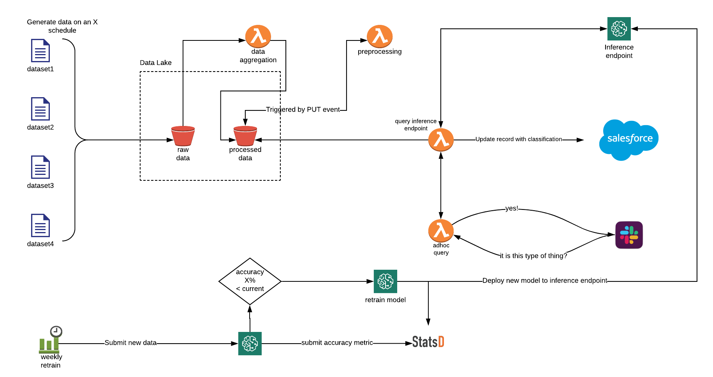

# 100 Days Of Code - Log

### Questions to Answer

- What do I do with date fields that have no values? how do I default them?
- How can I feed in new data into a model and it show me the results per row?
- What is Rank correlation? and what is monotonic data?
- What is a univariate relationships?

### Project ToDos:

Feature prep:

* (complete) Fix imputation: add <feature>_is_na column (handled in Fast.ai's preproc)
* Create histograms of each continuous feature. Any spikes or weird distributions that might indicate a messy dataset?
* Plot bar charts for categorical. Any features that have low cardinality or are really imbalanced that can be removed?
* Better time series approaches. Can you get a breakdown of cases opened per month?
* Any other features you could add to the training data? Engagement per day? Number of errors the user received etc?

Interpretations:

* Partial dependance plots. How do features related to each other? Ie if we increase the days elapsed keeping all other features fixed, how does it affect the probability?
* Explore some predictions with interpretations. Consider creating a spreadsheet of observations for each data point. Where is the model making decisions with noisy data for example?

### Day X Month Y, 2019

**Today's Progress**

**Thoughts:**

None.

**Link to work/resources:**

### Day 92 to 98 November 7, 2019

**Today's Progress**

I have been working through a new course, working with time series data because I can see huge potential for using that day to do for things like logging etc on my works platform.

`.asfreq('D')` use this to up or downsample time series data

I realised for my current use case that treating the data as time series doesn't work so I have gone back to interacting with my data data as a normal feature.

So the majority of the work has been trying to mould the cases data into a one liner for each live customer. So a problem I identified early on was what do I do with cancelled customers, how to I make sure they have data associated with them because the aggregation window is moving. So I am working on using the customers canceldate and working backwards from there to get the weekly, monthly, quarterly data.

The other powerful method I have been using is `.agg`, as you can see from the example, not only can you use standard functions to aggregate like sum and median but you can also create customer functions which you can pass in which works on every row, really powerful stuff.


```
# 90th Percentile
def p90(x):
    return x.quantile(0.9)

df.loc[df.date > month_ago].groupby(['n_number']).agg(['sum', 'mean', 'median', p90])
```

For the momment, given I am so close to finishing my 100 days of code, I have stopped learning more abut Panadas because I was struggling to use what I had learnt, that is what ill do on going is use it more then do more study down the track once I have mastered what I have already learnt.

**Thoughts:**

None.

**Link to work/resources:**

[Manipulating time series data in python](https://campus.datacamp.com/courses/manipulating-time-series-data-in-python/working-with-time-series-in-pandas)

### Day 88 to 91 November 30, 2019

**Today's Progress**

So another one bites the dust, and my mind has literally impoded with the possibilities!


Here are a bunch of things I have learnt in this course, a heap of practice is needed to see where I can better leverage Pandas.

Using groupby and unstack for visualisation:

```
# Create the DataFrame: usa
usa = medals[medals.NOC == 'USA']

# Group usa by 'Edition', 'Medal', and 'Athlete'
usa_medals_by_year = usa.groupby(['Edition', 'Medal'])['Athlete'].count()

# Reshape usa_medals_by_year by unstacking
usa_medals_by_year = usa_medals_by_year.unstack(level='Medal')

# Create an area plot of usa_medals_by_year
usa_medals_by_year.plot.area()
plt.show()
```

```
# Create the DataFrame: usa
usa = medals[medals.NOC == 'USA']

# Group usa by ['Edition', 'Medal'] and aggregate over 'Athlete'
usa_medals_by_year = usa.groupby(['Edition', 'Medal'])['Athlete'].count()

# Reshape usa_medals_by_year by unstacking
usa_medals_by_year = usa_medals_by_year.unstack(level='Medal')

# Plot the DataFrame usa_medals_by_year
usa_medals_by_year.plot()
plt.show()
```

`.idxmax(axis='columns')`

`.idxmin(axis='columns')`

`medals.NOC.isin(['USA', 'URS'])`

`.drop_duplicates()` -  can be used to drop dupes from a single feature or multiple

Use a pivot table to transform 

```
# Construct the pivot table: counted
counted = medals.pivot_table(index='NOC', values='Athlete', columns='Medal', aggfunc='count')

# Create the new column: counted['totals']
counted['totals'] = counted.sum(axis='columns')

# Sort counted by the 'totals' column
counted = counted.sort_values('totals', ascending=False)
```

Create custom labels or bins for your data, then you can group by it and get aggregates:

```
# Create the Boolean Series: under10
under10 = (titanic['age'] < 10).map({True:'under 10', False:'over 10'})

# Group by under10 and compute the survival rate
survived_mean_1 = titanic.groupby(under10)['survived'].mean()
print(survived_mean_1)

# Group by under10 and pclass and compute the survival rate
survived_mean_2 = titanic.groupby([under10, 'pclass'])['survived'].mean()
print(survived_mean_2)
```

`.filter` - used to filter a dataframe that has been grouped:

```
by_company = sales.groupby('Company')

# Filter 'Units' where the sum is > 35: by_com_filt
by_com_filt = by_company.filter(lambda g:g['Units'].sum() > 35)
```

Using the `.apply` method:

```
# Group gapminder_2010 by 'region': regional
regional = gapminder_2010.groupby('region')

# Apply the disparity function on regional: reg_disp
reg_disp = regional.apply(disparity)
```

So, this enables you to group your data by a feature, then perform complex actions on one or many features and return the results.

This example, shows how to use transform to get a dataframe returned with certain columns transformed but grouped by another field:

```
# Import zscore
from scipy.stats import zscore

# Group gapminder_2010: standardized
standardized = gapminder_2010.groupby('region')['life','fertility'].transform(zscore)

# Construct a Boolean Series to identify outliers: outliers
outliers = (standardized['life'] < -3) | (standardized['fertility'] > 3)

# Filter gapminder_2010 by the outliers: gm_outliers
gm_outliers = gapminder_2010.loc[outliers]
```

Using the `.agg` method to get aggregates for all rows:

```
df.agg(['max', 'median'])
```

This can be used when you have a grouped by and aggregated dataframe:

```
Out[7]: 
         age             fare         
         max median       max   median
pclass                                
1       80.0   39.0  512.3292  60.0000
2       70.0   29.0   73.5000  15.0458
3       74.0   24.0   69.5500   8.0500
```

```
df.loc[:, ('age','max')
```

Aggregating different features with a different method including custom:

```
# Define the function to compute spread: spread
def spread(series):
    return series.max() - series.min()

# Create the dictionary: aggregator
aggregator = {'population':'sum', 'child_mortality':'mean', 'gdp':spread}

# Aggregate by_year_region using the dictionary: aggregated
aggregated = by_year_region.agg(aggregator)
```

This is pure magic and needs more investigation but it looks like it can take a date column and turn it into a aggreage (ie day) and then group by that 🤯

```
# Read file: sales
sales = pd.read_csv('sales.csv', index_col='Date', parse_dates=True)

# Create a groupby object: by_day
by_day = sales.groupby(sales.index.strftime('%a'))

# Create sum: units_sum
units_sum = by_day['Units'].sum()
```

**Thoughts:**

None.

**Link to work/resources:**

### Day 84 to 87 November 26, 2019

**Today's Progress**

The last 4 days has been purely around learning more about Pandas dataframes, a follow on from the foundation course.

Below are just a bunch of random things of interest, mostly so I can come back and reference them:

To get a subset of columns from a Dataframe:

```
df[['col1', 'col2', 'col3']]
```

To slice a dataframe in reverse (assuming the index is the column you are slicing on:

```
df['value5':'value1':-1]
```

To select all rows and just some columns, this works the same as np.array:

```
df.loc[:, 'col_2':'col4']
```

You can use lists as well:

```
rows = ['Philadelphia', 'Centre', 'Fulton']
cols = ['winner', 'Obama', 'Romney']

election.loc[rows, cols]
```

A boolean filter can be super useful, the first line returns a boolean series and is used to filter the full dataframe:

```
filter = df['col_2'] > 70
df[filter]
```

Using a boolean filter to assign a value to a subset:

```
filter = df['col_1'] < 1

df.loc[filter, 'col_2'] = np.nan
```

You can use `.all()` to return features that have ALL nonzero values, it returns a boolean series.

`.any()` returns features with SOME nonzero values, it will not return features that have all zeros

To perform a custom function to a dataframe with no loops:

```
df.apply(lambda n: n*2)
```

This will take all values, from all columns and multiply them by 2.

Very powerful way to do custom operations over entire dataframes or selected features:

```
def to_celsius(F):
    return 5/9*(F - 32)

df_celsius = weather[['Mean TemperatureF', 'Mean Dew PointF']].apply(to_celsius)
```

A way to "map" one value to another:

```
red_vs_blue = {'Obama':'blue', 'Romney':'red'}

election['color'] = election['winner'].map(red_vs_blue)
```

`z-score` is the number of standard deviations by which an observation is above the mean - so if it is negative, it means the observation is below the mean.

```
from scipy.stats import zscore

zscore = zscore(df['col_1'])
```

A list comprehension is a succinct way to generate a list in one line. For example, the following list comprehension generates a list that contains the cubes of all numbers from 0 to 9:

```
cubes = [i**3 for i in range(10)]
```

This is equivalent to the following code:

```
cubes = []
for i in range(10):
    cubes.append(i**3)
```

So, you can do this with dataframe data en masse as well:

```
new_values = [i.upper() for i in sales.col_1]
```

You can name both columns and index in a Dataframe:

```
df.columns.name
df.index.name
```

Not entirely sure how to use that but we will see.

You can set multiple indexes (called a tuple):

```
sales.set_index(['state', 'month'])
```

This creates grouping and looks like this:

```
             eggs  salt  spam
state month                  
CA    1        47  12.0    17
      2       110  50.0    31
NY    1       221  89.0    72
      2        77  87.0    20
TX    1       132   NaN    52
      2       205  60.0    55
```

To filter on an index value:

```
df.loc['index_value']
```

When working with tuple indexes, you need to use this format:

```
df.loc[('value1', number1)]
```

Where the things inside the `()` are the values you want to filter by in the MultiIndex.

If you want to filter on a list of things in the index:

```
df.loc[(['val1', 'val3'], 2), :]
```

Just discovered `.pivot`, here is an example given this dataset:

```
  weekday    city  visitors  signups
0     Sun  Austin       139        7
1     Sun  Dallas       237       12
2     Mon  Austin       326        3
3     Mon  Dallas       456        5
```

What I want is rows indexed by 'weekday', the columns indexed by 'city', and the values populated with 'visitors', here is how:

```
df.pivot(index='weekday', columns='city', values='visitors')
```

This outputs:

```
city     Austin  Dallas
weekday                
Mon         326     456
Sun         139     237
```

if you omit `values=`, then it will create a dataframe with a `MultiIndex` and all other columns will be pivoted.

`.stack` and `.unstack` can be used to "unpack" MultiIndexes, not entirely sure how to use this yet but is an interesting method to play with. Here is an example:

```
df.stack(level='col_2')
```

`.swaplevel('index1', 'index2')` can be used to swap MultiIndexes

`.sort_index()` can be used to sort or group MultiIndexes

`.reset_index()` resets the index of the DataFrame, and use the default one instead. If the DataFrame has a MultiIndex, this method can remove one or more levels.

`.melt` this is used for changing a pivot view back to a flat view, again not sure where I will use this but here is an example:

Example dataframe:

```
city weekday  Austin  Dallas
0        Mon     326     456
1        Sun     139     237
```

I want to change city to per row, I use this:

```
pd.melt(visitors_by_city_weekday, id_vars=['weekday'], value_name='visitors')
```

and get this:

```
  weekday    city  visitors
0     Mon  Austin       326
1     Sun  Austin       139
2     Mon  Dallas       456
3     Sun  Dallas       237
```

**Thoughts:**

None.

**Link to work/resources:**

[Manipulating dataframes with Pandas](https://campus.datacamp.com/courses/manipulating-dataframes-with-pandas)

### Day 79 to 83 November 22, 2019

**Today's Progress**

Another big 5 days of learning, this time around Pandas. I have completed the Pandas Foundation course on Datacamp which has been hugely useful already. Here is proof:


I definitely needed to do this earlier because I have been really struggling with using Dataframes effectively. I will be continuing the learning around this in the coming weeks.

So the dilemma I have now is, do I continue doing this foundational type learning or do I try and get my teeth into another algorythm (ie Gradient Boosting) ... not sure at this stage. I think I will complete a few more "Python in Data science" type courses and see where that gets me in the next week.

Below is a long list of random, but useful things I have learnt along the way:

users['fees'] = 0 <- when doing this and 'fees' is a new column in a data frame, they call it `broadcasting` as it broadcasts `0` to all rows in the dataframe in the new column.

Even more powerfully, if you are creating a dataframe from a `dict` type (dictionary) you can do something like this:

```
h = [ 1, 2, 3 ]
data = { h: h, 'b': 'b' }

results = pd.DataFrame(data)
```

This creates a data frame with h as the values in the list, and `'b'` in the `b` column, so it `broadcasts` the `'b'` value to all rows.

This is super cool, `pd.read_csv()` has some powerful options, here is an example:

```
df2 = pd.read_csv(file_messy, delimiter=' ', header=3, comment='#')
```

If you want to just show certain columns in a dataframe you can do this:

```
cols = ['weight', 'mpg']

df[cols]
```

If you want to put plots of different rows:

```
fig, axes = plt.subplots(nrows=2, ncols=1)

df.column_name1.plot(ax=axes[0], kind='hist')
plt.show()

df.column_name2.plot(ax=axes[1], kind='hist')
plt.show()
```

If you want to get the mean of each row by the index (this is useful when the index of a dataframe is a date or year.

```
df.mean(axis='columns')
```

When working with a DateTimeIndex, you can do things like this:

```
# Extract the hour from 9pm to 10pm on '2010-10-11': ts1
ts1 = ts0.loc['2010-10-11 21:00:00':'2010-10-11 22:00:00']

# Extract '2010-07-04' from ts0: ts2
ts2 = ts0.loc['2010-07-04 21:00:00']

# Extract data from '2010-12-15' to '2010-12-31': ts3
ts3 = ts0.loc['2010-12-15':'2010-12-15']
```

Here is a good example of using a DateTimeIndex and the `.rolling` method. This is SO powerful when trying to get a feeling of trends, I can see if being invaluable going forward.

```
unsmoothed = df['Temperature']['2010-Aug-01':'2010-Aug-15']
smoothed = unsmoothed.rolling(window=24).mean()
august = pd.DataFrame({'smoothed':smoothed, 'unsmoothed':unsmoothed})
august.plot()
plt.show()
```

A Pandas Dataframe is made up of multiple Panadas Series. Therefore you can create a Dataframe from 2 or more Pandas Series.

`.describe()` can be used on one or more Pandas series, the reason it works on a Dataframe, is because it is just multiple Series.

`.interpolate(how='linear')` can be used to more easily fill in missing data, best used with temporal continuous data.

Add a date and time together into one feature:

```
times_tz_none = pd.to_datetime( la['Date (MM/DD/YYYY)'] + ' ' + la['Wheels-off Time'] )
```

If you want to plot a date range:

```
df.Temperature['2010-06-10':'2010-06-17'].plot()
plt.show()
```

The cool thing about this is the labelling of the X axis is taken care of.

So this is cool, creating a `mask` as a filter:

```
# Using df_clean, when is sky_condition 'CLR'?
is_sky_clear = df_clean['sky_condition']=='CLR'

# Filter df_clean using is_sky_clear
sunny = df_clean[is_sky_clear]
```

so `is_sky_clear` is a Pandas Series, which is essentially a `True`, `False` list. You can then pass it into your dataframe and it will return the `True` rows within the Dataframe.

Here is how to see if a couple of features correlate:

```
# Select the visibility and dry_bulb_faren columns and resample them: weekly_mean
weekly_mean = df_clean[['dry_bulb_faren', 'visibility']].resample('W').mean()

# Print the output of weekly_mean.corr()
print(weekly_mean.corr())
```

**Thoughts:**

None.

**Link to work/resources:**

[Pandas Foundations - Datacamp](https://campus.datacamp.com/courses/pandas-foundations)

### Day 77 and 78 Novermber 17, 2019

I decided to go back and do some more basics and started with an intro to python for data science. I have realised over the last week or so that my python foo needs a level up as I am strugging with some of the complex things I am trying to do with my data and to be honest, I was fumbling around.

Couple random things I learnt:

List slicing, the start index is inclusive, the end is exclusive

```
list[1:3]
```

numpy arrays are super powerful, you can do things like this:

```
a = np.array([1, 2])
b = np.array([3, 4])

a + b = [4, 6]

a ** 2 = [2, 4]
```

Reference 2D numpy arrays is also cool

```
a = np.array([[1, 2], [3, 4]])

a[:,0] = [1, 3] (gets the first column of each row
```

Do (100 * 1.1) 7 times.

```
print(100 * 1.1 ** 7)
```

I finished the course!


**Today's Progress**

**Thoughts:**

None.

**Link to work/resources:**

[Introduction to Python](https://campus.datacamp.com/courses/intro-to-python-for-data-science)

### Day 71 to 76 Novermber 16, 2019

**Today's Progress**

It has been super slow going over the last 6 days, having an overseas business trip didn't help but I still got some work done over that time.

I have been spending time honing my data manipulation skills with python, really trying to get a hang of panads dataframes and how to efficiently generate and replace values.

I have started working on building some ETL code to aggregate customer support case data from sales force which has proven challenging, mainly because I was trying to do it in gsheets but because of the sheer volume of data, it just wouldn't do what I needed it to do.

One useful thing I did discover was how to take year and month features and generate a proper date from them:

```
df['date'] = pd.to_datetime(df.assign(day=1).loc[:, ['year','month','day']])
```

This generates a datetime dtype `date` which you can be very useful.

I also dicovered `relativedelta` which helps to generate future or past dates:

```
df.iloc[1].date + relativedelta(months=-1)
```

^ this gives me a date a month before the date in question, super useful when looking for ranges of dates.

Now I haven't found a good use for this one yet but, this helps generate different values for things grouped by time. So if I wanted to know the `mean` of the number of customer support tickets for a particular customer over the last 12 months I can use this:

```
df.open_cases.loc[(df['customer id'] == '1234567')].resample('M').mean()
```

This is the output:

```
date
2018-01-31    0.000000
2018-02-28    0.000000
2018-03-31    0.000000
2018-04-30    0.000000
2018-05-31    0.071429
2018-06-30    0.000000
2018-07-31    0.055556
2018-08-31    0.000000
2018-09-30    0.058824
```

The only trick with using this is you have to change the index of your dataframe to use the date:

```
df.set_index('date', inplace = True)
```

Usually panads by default uses a self generated `index` feature, like an auto index in MySQL.

**Thoughts:**

None.

**Link to work/resources:**

None.

### Day 69 and 70 November 10, 2019

**Today's Progress**

The last two days have been super productive thanks to a new ML mentor I have connected with through the Queensland AI meetup. He has helped me get a really good grasp on what I am trying to do and what numbers to watch.

Firstly, I have settling on ensuring `precision` is high and `recall` is low. For my business case it is more important to correctly classify ANY records, I am not too fussed how many (at this stage) it correctly identifies from the total number.

Second is, I have a good understanding of what `lift` is, so I know what my % value is for a random selection, I can now calculate how much better my predictions are than a random sampling.

target-classification/(non-target-classifiaction+target-classification) = % of random selection

So if

target-classification = 3084
non-target-classification = 1823

3084/(1823+3084) or 62.85%

So if my "lift" is

precision / (% of random selection)

So if my precision on my validation dataset is 86%
And my random sample selection is 62.85%

then my "lift" is 36.83% better than random sampling

Random stuff:

Sample code to fix the order of a categorical feature:

```
df.feature_x.cat.set_categories(['day', 'few_days', 'week', \
								 'fortnight', 'month', 'month+'], ordered=True, inplace=True)
```

Doing a `.value_counts()` type operation on numpy array:

```
unique_elements, counts_elements = np.unique(y_valid, return_counts=True)
print("Frequency of unique values of the said array:")
print(np.asarray((unique_elements, counts_elements)))
```

**Thoughts:**

None.

**Link to work/resources:**

[What is "lift"](https://en.wikipedia.org/wiki/Lift_(data_mining))

### Day 65, 66, 67 and 68 November 8, 2019

**Today's Progress**

Another very slow 4 days, most of which has been spent on feature engineering around customer support case ticket aggregates (ie total last month, total this month etc per customer). This was to try and get trends rather than continuous values which seem to be less than useful.

Last Thursday, I was lucky enough to be invited to speak at the Queensland AI meetup, the topic, my journey to date on the 100 days of coding.


I discussed my struggles in the beginning with ML and dealing with the "I am not smart enough to do this type of stuff". Thanks to a few key individuals (aka Daniel Bourke and Lex) I was able to over come that and make some great head way over the lsat 68 days.

I have started to communicate to the organisation that I work for around what I have been up to and what the next steps are. I am looking forward to creating a heap of content around this over the coming months.

The focus for the next week will be ensuring I can get this work into product and start it being used.

One of the coolest tooling discoveries I have made over the week is the [weights and biases site](app.wandb.ai). I had an on going problem of not being able to track how my changes were impacting my model's accuracy over time. This service enables you to easily submit not only accuracy scores but also metadata (ie model hyperparameters) and files, so you can upload your actual model and your validation sets.

Here is an example of types of visualisations you can get from it:


**Thoughts:**

None.

**Link to work/resources:**

None.

### Day 60 to 64 November 4, 2019

**Today's Progress**

Another 5 days of neglected posting but heaps of learnings. I am on the brink of having my project being "released" into production. That being that we are going to start using the data which is coming out of my inference endpoint will be folded into our Customer Success process to help priorities calls.

Something that I have been really struggling with was, how do I "version control" my work on the model. Because notebooks are a big blob of info and essentially every time you run the notebook it changes the entire file, it is quite difficult to keep track of how you have tuned or modified your code or model. The problem I was having was when I made changes that adversely affected my model, I couldn't just "rollback" to a last known good state, I would have to remember changes I had made and undo the code or hyper parameter changes.

After another awesome catch up with my ML mentor, he introduced me to the "weights and biases" service. It is primarily for strudents and researches but it allows you to submit data (ie accuracy scores), model hyperparameters and actual file artifacts (ie your model, any saved validation sets etc). This is revolutionised the way I work. This service logs every run I do in my notebooks, stores a bunch of metadata around my model tuning, logs a bunch of accuracy scores and also uploads the actual model that I trained.

Here is my [public profile](https://app.wandb.ai/justinhennessy), you can see how many runs I do a day!

Something that I also convered in my last chat with my mentor is "continous data pipelines", I was really excited to discuss that because it then falls into the same pattern as coding CI/CD (Continuous Deployment).

Here is a concept diagram that I have created to show how this might work:



This essentially means, the creation of the aggregated data and the training of the model (on going) becomes completely automatic. Obviously it would need to be monitored but it has all the parts needed for a continously delivered and current machine learning model!

**Thoughts:**

None.

**Link to work/resources:**

None.

### Day 58 and 59 October 30, 2019

**Today's Progress**

I discovered a floor in some of my pre processing code which was causing skewed results when looking at feature importance.

I am now getting very close to my inference data being used in a practical way which is super exciting. Although I can't talk specifics, it is such a good feeling to be at the useful (well hopefully) end of the process.

The biggest issue I still have is around validating the data that is coming out of the process. I can now see the "why" but can't with full confidence, hand on heart say "this is it, its correct", whatever that means.

So the next chunk of work is going to be less exciting and that is fine better was to get access to the base data and start to look at ways to automate the generation of that data and automate the ELT process.

The other outstanding item is deploying the inference code somewhere. Given most of my experience is on AWS, SageMaker is the likely starting point though I would definitely be happy to look at other providers in the future like Google, Azure or IBM (though I have little knowledge of what hosted options they have). What is involved in the AWS deployment is the building of a custom container, register it with AWS ECR (Elastic Container Registry) then point SageMaker at it. I had an article which I found at some stage but for the life of me can't find it, so another thing on the todo. :)

**Thoughts:**

None.

**Link to work/resources:**

None.

### Day 55, 56, and 57 October 28, 2019

**Today's Progress**

The last 3 days of been a very hard slog and very difficult to keep focused. I have made little progress and have definitely felt like I had been losing steam. Because I dont have any official source to validate my work, it is becoming more difficult to move forward. Ill keep slogging through, a break through is inevitable.

**Thoughts:**

None.

**Link to work/resources:**

None.

### Day 51, 52, 53 & 54 October 25, 2019

**Today's Progress**

To be honest, the last 3 days have been very difficult and I have hit a significant road block. I now have a working process end to end, I can pre process my data, train my model, I can then get a "real" list of data and pass it through my inference code and get an output.

The issue I have now is, I need some more data to add to my master dataset and I am having trouble getting it. I am also still struggling with the "why" the model chose something.

The other issue is I am getting wildy different results between my working environments (my work laptop and my home desktop). The other day I was getting 0.8 something on my AUC (area under the curve) but when I transferred my work to my home laptop I was getting 0.551. I then ensured I had consistant code and data and got the two working environments returning about the same. I then tried the next morning and suddenly my working environment was 0.91! Anyway, just something to keep an eye on. I am not random sampling so I am not sure why the results are so different (though I would expect some differences).

One positive thing I have achieved is utilising the eli5 library to try and get some better understanding as to why the model is classifying certain records. I have also got a much deeper understanding of how panadas works and how to move through dataframes, especitally correlating pre and post data processing dataframe data.

So the use of eli5 is quite easy, here is some sample code:

```
from eli5 import show_prediction

loc_address = df_filtered[df_filtered.username == n_number].index[0]
show_prediction(churn_model, df_data.loc[loc_address], show_feature_values=True)
```

So what I am doing here is, finding a specificy row in my pre processed dataframe (before I split the data and pass it through my inference code) and returning its row location. I then use the `show_prediction` method from the eil5 library to pass that through raw of my dataframe through my trained model.

This then outputs a table showing each feature, its value and how much influence, either positive or negative, it has on the classification process.

What has been really good is as I have refined my process and filtered out feature noise and rubbish data, the things the model is seeing as important is starting to make sense.

**Thoughts:**

None.

**Link to work/resources:**

None.

### Day 50! October 21, 2019

**Today's Progress**

Well we made it half way. Hands down this is the most focused I have been in learning any topic for a very long time. The results speak for themselves, I am perhaps 1-2 weeks away from having something that will be usable (in a testing capacity at least) in production.

Once again I am back into understanding my data and using techniques to either smooth out or enriching what I have. I am also learning a lot about what feature engineering is and how to do it effectively.

One of today's learnings has been about binning, here is some example code I can talk to:

```
def preprocess_last_login_days(df):
    # 'bin' last login days
    bins = [-1, 2, 4, 7, 15, 30, df['last_login_days'].max()]
    group_names = ['day', 'few_days', 'week', 'fortnight', 'month', 'month+']

    # need to get the mean of the plan size for last_login_days and set each row to that
    #df_raw.last_login_days = df_raw.last_login_days.fillna(np.mean(df_raw.last_login_days))

    df['last_login_categories'] = pd.cut(df['last_login_days'], bins, labels=group_names)
    print(df['last_login_categories'].value_counts())
    return df
```

When I started using binning I read the "bins" array as, if your value is above this then it will go into the X bin. What I discovered (unsurprisingly) is they are ranges. So take for instance my array `[-1, 2, 4, 7, 15, 30, MAX]`, the way to read this is, if my value is between `-1` and `2` then it will end up in bin `day`. Why this is important is because when you get to the last bin, if you dont have a range that encompasses all your values in a feature then they will not get binned. Too me a while to figure this out and I had to use `.value_counts` and also output the number of items that were above the value of my last bin. To fix this I just added the MAX value of the feature and had a "catch all" bin at the end, which worked quite nicely.

**Thoughts:**

None.

**Link to work/resources:**

None.

### Day 47, 48 and 49: October 20, 2019

**Today's Progress**

So, in just under a week, with some awesome help from my online mentors, I have improved my models AUC (area under the curve) from 0.551 to 0.810!


I have learnt a heap around how to pre process my data better and what feature engineering (which is domain specific) I needed to do. One interesting investigation I did today was around an abnormal spike I saw in one of my features:


This turned out to be data that was changed 6 years ago, a manual adjustment if you will. My initial method for helping smooth this out was to replace the specific value (2153 for interest at that time) with the median. I then added a feature "was_modified" to indicate I had changed the original value. What I found was, it actually moved the spike:


So, and I haven't validated statiscally if this is a good process, I decided to replace the value with a random value, either the mean, trimmed mean or median, just to try and smooth it out a little more. What was cool about this effort was I got much more intimatedly involved with pandas dataframes and started to get a great understanding (and appreciation) of them. For reference, here is the code I created to help me with this:

```
def random_replace_value(df, feature):
    median = df[feature].median()
    mean = df[feature].mean()
    trimmed_mean = trim_mean(df[feature].values, 0.1)
 
    random_choice = random.randint(1, 3)
 
    if random_choice == 1:
        value = mean
    elif random_choice == 2:
        value = trimmed_mean
    else:
        value = median
 
    return value
 
  def fix_spike(df):
      feature = some_continous_value
      df[feature + '_modified'] = 0
 
      for i in df[(df['date'] == '11/25/2013') & (df['status'] != "X")].index:
          df[feature][i] = random_replace_value(df, feature)
          df.loc[i, feature + '_modified'] = 1
      return df
```

So what is really cool about this, is I can filter out a subset of my dataframe then using `.index` I can reference each row. Where this becomes important is when you want to change a value and create a new feature to make that row that it has been modified in some where.

Here is the resulting graph, a nicely smooth histagram:


Something that has just happened is, the output from my inference endpoint has dramatically dropped in "churn" count. So either, I have done some great and now it is being a little more choosey what it marks as churned or ... I have broken it. :) Stay tuned for Day 50! That will be my primary goal is to try and explain what happened.

The most important lesson I have learnt is, when replacing missing or NaN values, ensure you add a new feature which "tags" that you have replace a value with something synthetic. So you might have `days_active`, if you replace any missing values with lets say the `.median()` then you add a `days_active_was_nan` column and make it equal to 1. The fastai library does this for you, the `.proc_df()` method but it uses the mean, as I wanted to try and median, I "rolled" my own.

I am always looking for measures of "accuracy" and discovered `Cohen Kappa Score` a couple of weeks ago but didn't really understand what it was telling me. I got a definition from one of my Data Science mentors, I dont completely understand what the `Cohen Kappa Score` measures yet but I will dig a bit deeper later. This definition just helps to use it:

```
Cohen Kappa Score should be a single number between 0 and 1 and can be inpretted something
like: "0–0.20 as slight, 0.21–0.40 as fair, 0.41–0.60 as moderate,
0.61–0.80 as substantial, and 0.81–1 as almost perfect agreement"
```

**Thoughts:**

None.

**Link to work/resources:**

None.

### Day 46: October 17, 2019

**Today's Progress**

So, quite an exciting time. My project is getting near to a place where the data generated by the inference endpoint is going to be useful. I have a call this afternoon with one of my very generous mentors (you know who you are :) ) to help me validate the results I am seeing and hopefully be able to understand "why" the results are what they are. I will have a heap of questions for them by the end of the day.

The focus I have been on at the moment is working through a pluralsight stats course (link below), this is to try and start getting my head around the math involved in both statistics and probability because I think the general use of this knowledge will serve me well in other areas.

Having got a good feel for the importance of the data cleansing and pre processing, I am starting on another course which covers unit tests for Python (link below) to ensure once I start building production use code, that it is treated as a first class citizen.

**Thoughts:**

None.

**Link to work/resources:**

[Unit Testing with Python](https://app.pluralsight.com/library/courses/using-unit-testing-python/table-of-contents)

[Statistics Foundations: Understanding Probability and Distributions](https://app.pluralsight.com/library/courses/statistics-foundations-probability-distributions/table-of-contents)

### Day 44 & 45: October 16, 2019

**Today's Progress**

The last 2 days has been heavily focused on my project and getting closer to the data. I was able to lift my Area Under the Curve (AUC) value by 0.24 (from 0.55 to 0.79) because I realised (after consulting with domain experts) I had some rubbish data in my dataset that I was using to train my model.

Very little to say other than, holy moly does cleaning and preprocessing your data take some time. I am looking forward to building up some common patterns and tools to help with that because the ramp up time is horrendous, I can't imaging talking on a domain I didn't know, it would be impossible at this point, but I will get there. :)

Very little to say other than, holy moly does cleaning and preprocessing your data take some time. I am looking forward to building up some common patterns and tools to help with that because the ramp up time is horrendous, I can't imaging taking on a domain I didn't know, it would be impossible at this point, but I will get there. :)

Below is my latest Receiver Operating Characteristics (ROC) Curve which measures the number of True Positives (ie ones that were correct) and False Positives (the ones that weren't). The precision-recall curve is exactly that, plots the precision (the models ability to return only relevant items) and recall (the models ability to identify all relevant items). These are always at odds and the trick is finding an acceptable balance between them.


**Thoughts:**

None.

**Link to work/resources:**

None.

### Day 42 & 43: October 14, 2019

**Today's Progress**

The last 2 days have been spent on learning about power (aka variance-stabilising) transformations and how they help to better distribute the data in a particular feature.

I have found what often happens is I find that my data has a Poisson distribution ie skewed to one side with a long tail:


Power transforms help us "stabilise" the data and moves it more to a Gaussian distribution (ie a bell curve). Below is an example of a feature I was working on that started out quite heavily skewed to the left but after performing some power transformations (ie log) on the data, you can see it transforms it more into a normal distribution pattern.

To be honest, I am still trying to understand the basics as to why this matters but from what I can gather is normal distribution data trends towards the mean so if you can get your data distributed in that way then things like linear regression etc will be more effective.

Would love to hear from some stats people to validating this train of thought. :)


**Thoughts:**

None.

**Link to work/resources:**

None.

### Day 40 & 41: October 12, 2019

**Today's Progress**

The last few days have been deep in EDA (Exploratory Data Analysis), almost going back to the drawing board but looking at the data I have for my project, making sure that it makes sense, that I am setting missing values to sane values etc.

I have done a lot of reading on using `log` to help mitigate data that has big orders of magnitude in them, ie annual revenue or ticket counts/age hours etc. This helps to compress the data and mitigate having big outlying numbers which can skew your results.

I have also started to gain an appreciation for the "what" I am looking for in my data if everything was normally (Gaussian) distributed filling in missing data and working with the data would be much more straight forward. To understand how your data is distributed helps to inform how to treat the data.

I have created a little method that transforms a feature using log and removes the old column, it might be useful to someone:

```
def logify_feature(df, feature):
    df[feature + '_log'] = np.log(df[feature])
	df[feature + '_log'] = df[feature + '_log'].replace(-np.inf, np.nan)
	df[feature + '_log'] = df[feature + '_log'].isna().fillna(df[feature + '_log'].mean())
	df = df.drop(columns=[feature])
	return df
```

**Thoughts:**

None.

**Link to work/resources:**

None.

### Day 38 & 39: October 10, 2019

**Today's Progress**

The last 2 days have mostly been on learning more about plotting and using it for other things other than my project. I am really just getting used to using the tooling generally which should be super helpful in the future.


I have also been working more on my preprocessing work for my project, using binning a little more to simplify my data but also make it more resilient to "count" fields. As count fields grow, they can grow outside the ranges the ML model has learnt about, making it less effective.

**Thoughts:**

None.

**Link to work/resources:**

None.

### Day 35, 36 & 37: October 8, 2019

**Today's Progress**

I was away for a holiday for a long weekend so only did theory work up until this morning. I pretty much finished the Practical Statistics book and started reading "Feature Engineering for Machine Learning" which is been brilliant. Again, the right information has appeared at the right time when I needed it. :)

The Practical Statistics reading was mostly around imbalanced datasets, I have had a suspicion for a little while that that is part of the issues I have with my model being overly agreesive in identifying my "1" case.

Last night and this morning, I have been reading about dealing with simple number (scalar) features. What I did not think about was, if you are training your model around data that is infinitely growing (ie a lifetime count) then eventually your numbers will outgrow what your model has learnt. A way to deal with this is to utilise the "binning" technique I have referenced before. The simplest two examples are fixed-width and percentile binning.

A good example of fixed-width binning is support-case ticket count, you can put them into groups eg "10+", "100+" etc. This creates a more coarse grain view of this data and is not affected by outliers or changes over time.

The second is using percentiles. Pandas has a very cool method called `.quantiles` and is used like this:

```
df_raw[scalar_feature].quantile([.1, .2, .3, .4, .5, .6, .7, .8, .9])
```

This breaks up your scalar into percentile buckets (10% to 90% in this case). Here is some example output:

```
0.1      43.0
0.2     215.0
0.3     489.0
0.4     773.0
0.5    1204.0
0.6    1732.0
0.7    2482.0
0.8    3645.0
0.9    5693.0
Name: cases_age_hours_total, dtype: float64
```

So you can probably see this works perfectly with the "binning" method as you pass these values in as the bins. Again, helps to stablise your data for growing counts.

Here is a very cool visualisation which shows the data with an overlay of the "bins".


**Thoughts:**

None.

**Link to work/resources:**

None.

### Day 34: October 5, 2019

**Today's Progress**

Today was a great day, I now have a jupyter notebook which does my training and save my model. I have another notebook that loads the trained model and uses it for inference. My results are not great but that doesn't matter at this stage, I now have everything I need to make it practically useful, the steps are to go back to my training data because I think the prevalence of the "1" classified case is too frequent so it sees everything as that.

**Thoughts:**

None.

**Link to work/resources:**

None.

### Day 33: October 4, 2019

**Today's Progress**

So, discovered today that to get my model running on SageMaker, I need to build a custom docker container. It doesn't look too difficult, I will just need a big block of time to concentrate so will be a job for next week.

I have attached a link below to some instructions on the process which I got from AWS support (including a bunch of others), AWS Support were actually super helpful which is good.

What this means is my production deployment will need to be fairly manual. Given I have internally committed to "launching" the use of it next week, just means I will have to do the work manually while I build up the skills to create the container.

**Thoughts:**

None.

**Link to work/resources:**

[Instructions on how to deploy a custom container to SageMager](https://github.com/awslabs/amazon-sagemaker-examples/blob/master/advanced_functionality/scikit_bring_your_own/scikit_bring_your_own.ipynb)

[SageMaker Invoke Endpoint instructions](https://docs.aws.amazon.com/sagemaker/latest/dg/API_runtime_InvokeEndpoint.html)

[AWS doco - API_CreateModel](https://docs.aws.amazon.com/sagemaker/latest/dg/.html)

[AWS doco - API_CreateTrainingJob](https://docs.aws.amazon.com/sagemaker/latest/dg/API_CreateTrainingJob.html)

[AWS doco - API_CreateEndpoint](https://docs.aws.amazon.com/sagemaker/latest/dg/API_CreateEndpoint.html)

[AWS doco - API_CreateEndpointConfig](https://docs.aws.amazon.com/sagemaker/latest/dg/API_CreateEndpointConfig.html)

[AWS doco - API_runtime_InvokeEndpoint](https://docs.aws.amazon.com/sagemaker/latest/dg/API_runtime_InvokeEndpoint.html)

[AWS doco - Example Dockerfile](https://github.com/awslabs/amazon-sagemaker-examples/blob/master/advanced_functionality/tensorflow_bring_your_own/container/Dockerfile)

[AWS doco - build and push example script](https://github.com/awslabs/amazon-sagemaker-examples/blob/master/advanced_functionality/tensorflow_bring_your_own/container/build_and_psh.sh)


### Day 32: October 3, 2019

**Today's Progress**

Well, we begin the journey of getting something actually working in "production". I have uploaded my jupyter notebook into AWS SageMaker and have successfully got all of the libraries installed using `pip`.

I didn't realise you can run shell commands directly from a notebook using the `!` operator, so something like `!pip install package` will install the package in the underlying OS which is awesome, means I can "document" the commands that need to run for setup except you can actually run them as well.

**Thoughts:**

None.

**Link to work/resources:**

[Example of loading data from s3](https://stackoverflow.com/questions/37703634/how-to-import-a-text-file-on-aws-s3-into-pandas-without-writing-to-disk)

[Example of production code for a python endpoint](https://github.com/awslabs/amazon-sagemaker-examples/blob/master/advanced_functionality/fastai_oxford_pets/source/pets.py)

### Day 31: October 2, 2019

**Today's Progress**

Holy crap, where do I start ...

Once I started playing with the confusion matrix, I realised there were a heap more metrics I could output and visualise to help me figure out if what I was building was acutally useful, which ultimately what I am after.

Here are some high level concepts I started digging into:

`Correlation coefficient` - this measures the extent to which numeric variables are associated to one another. Pandas has a very cool method `.corr()` which enables you to render a `Correlation matrix`.

`Correlation matrix` - a table where all variables are shown on rows and columns, cell values are the correlation.

Here is a cool little function that visualises it:

```
def graph_corr(pandas_dataframe):
    fig, ax = plt.subplots(figsize=(20,10))
    corr = pandas_dataframe.corr()
    sns.heatmap(corr, cmap='YlGnBu', annot_kws={'size':30}, ax=ax)
    ax.set_title("Correlation Matrix", fontsize=14)
    plt.show()
```

`mean, trimmed mean and weighted mean` - discovered there are many different ways to calculate the `mean` and different ways to use it. `trimmed mean` is simply your feature sorted, then you removed the top % percent from both the high and low ends which makes `trimmed mean` `robust`. `weighted mean` I am not completely sure on yet so haven't used it.

`Robust` - so apparently in statistics, something that isn't sensitive to outliners (ie extreme values) is considered `robust`.

`Probability cutoff` - so a models ability to `predict` is simply a measure of probability then deciding what threshold you want to use for it to either consider it (in my case a calassifier) either in your dependant class or not (ie churn, not churn).

`Covariance` - a measure of the extent to which one variable varies in concert with another ie similar magnitude and direction.

`Discriminant function` - when applied to a the predictor variables, maximises the separation of the classes

`Discriminant weights` - scores that result from the application of a the discriminant function and used to estimate probabilities of belonging to one class or another

Discrimination analysis can provide a measure of predictor importance, used for feature selection.

`Accuracy` - the % of cases classed correctly

`Sensitivity (recall)` - % of 1s correctly classified

`Specificity` - % of 0s correctly classified

`Precision` - % of predicted 1s that are actually 1s

`Receiver Operating Characteristic (ROC) curve` - a plot of sensitiveity vs specificity

`Area under the curve (AUC)` - Each point on the ROC curve represents a sensitivity/specificity pair corresponding to a particular decision threshold. The area under the ROC curve ( AUC ) is a measure of how well a parameter can distinguish between two diagnostic groups (churn/not churn).

`Lift` - a measure of how effective the model is at identifying (comparitively rare) 1s at different probability cut offs

**Thoughts:**

None.

**Link to work/resources:**

### Day 30: October 1, 2019

**Today's Progress**

`Confusion matrix` - 2 x 2 table which record counts by their predicted and actual classificiation. True positive, False Positive, True Negative, False Negative (left to right, top to bottom):

```
[[349  70]
 [ 23  58]]
```

Dependant on the context of your use case, you will want to optimise some aspect of this matrix and try and achieve a certain level of accuracy, again dependant on the particular problem you are trying to solve.

`Tuning hyperparameters` - Python has some very cool tools to help you figure out how to tune your learning model. This is just one example I was playing with for my RandomForestClassifier.

```
# Create the hyperparameter grid
param_grid = {'max_features': ['auto', 'sqrt', 'log2'],
                  'min_samples_leaf': np.arange(1,3),
                  'n_estimators': np.arange(1,10),
                  'class_weight':[{0: w} for w in [1, 2, 3, 5, 10, 20]],
                  'bootstrap': [True, False],
                  'criterion': ['gini', 'entropy'],
                  'max_depth': [None, 1, 2, 3]
                 }

# Call GridSearchCV
grid_search = GridSearchCV(RandomForestClassifier(), param_grid)

# Fit the model
%time grid_search.fit(X_valid, y_valid)

print(grid_search.best_params_, grid_search.best_score_)
```

Be warned this can run for a long time dependant on how much params you give it. If it isn't obvious it goes through every permutation and every value to find the best result. The outcome from this, it will give you a list of values for each param that it believes is optimal, here is an exmple of the output:

```
{'bootstrap': True, 'max_features': 'auto', 'n_estimators': 8}
```

Random things:

`isinstance(object_you_are_testing, pd.DataFrame)` - will return true if its a dataframe

**Thoughts:**

None.

**Link to work/resources:**

[What is a dendogram](https://www.displayr.com/what-is-dendrogram/)

[Synthetic Minority Over-sampling Technique (SMOTE)](https://discuss.analyticsvidhya.com/t/smote-implementation-in-python/19740)

[Imbalanced-learn (python library)](https://github.com/scikit-learn-contrib/imbalanced-learn)

[Imbalanced dataset here is how you can solve it](https://towardsdatascience.com/having-an-imbalanced-dataset-here-is-how-you-can-solve-it-1640568947eb)

[Plotting multiple scatter plots pandas](https://stackoverflow.com/questions/43061768/plotting-multiple-scatter-plots-pandas)

### Day 29: September 30, 2019

**Today's Progress**

Finished my first datacamp course through to the end today! That is all. :)


**Thoughts:**

None.

**Link to work/resources:**

[The Right Way to Oversample in Predictive Modeling](https://beckernick.github.io/oversampling-modeling/)

[Cohen's kappa](https://en.wikipedia.org/wiki/Cohen%27s_kappa)

[Tactics to combat imbalanced classes](https://machinelearningmastery.com/tactics-to-combat-imbalanced-classes-in-your-machine-learning-dataset/)


### Day 28: September 29, 2019

**Today's Progress**

I am nearing the end of the [datacamp](datacamp.com) course which has been super useful and now have a heap more confidence in what I am looking at. I am looking forward to applying all of this learning to my own project.

One powerful thing I discovered today was `grid search`. This is a tool that enables you to "brute force" the "best" values for the hyperparameters for your learning algorithm which help tune its effectiveness. Again looking forward to applying this to my own work and see what I can get from it.

I am going to commit to have something to present in the next 2 weeks

**Thoughts:**

None.

**Link to work/resources:**

[Predicting customer churn in Python](https://campus.datacamp.com/courses/predicting-customer-churn-in-python)

### Day 27: September 28, 2019

**Today's Progress**

Continued work on the [datacamp](datacamp.com) course, every chapter builds on the last so I am getting more and more insights into where I am going wrong with my model. Today I covered confusions matrix which then leads into understand precision and recall which I have mentioned before. From there you can then get an f1_score which tells you how well your model can identify "positive" cases of what you are looking for (from the whole) ie precision, then show you how well your model generalises ie recall.

**Thoughts:**

None.

**Link to work/resources:**

[Predicting customer churn in Python](https://campus.datacamp.com/courses/predicting-customer-churn-in-python)

### Day 26: September 27, 2019

**Today's Progress**

Today I started a new course on [datacamp](datacamp.com) I found almost by accident and is hugely relevant to my project. What is good about Datacamp (so far anyway) is it is at a high level, very easy to understand and has practical programming sections. I have been able to take every example I have worked on and apply it to my own work which has been really useful. I feel way more confident in intepreting the results I am seeing through my model which is now key to getting to a state where it could actually have business implications, we will see how the next week goes. :)

**Thoughts:**

None.

**Link to work/resources:**

[Predicting customer churn in Python](https://campus.datacamp.com/courses/predicting-customer-churn-in-python)

### Day 25: September 26, 2019

**Today's Progress**

Today was working on my dataset again. After talking with a very generous soul on Linkedin (Thanks Larry :) ), I have moved my dependant variable back to "churned" because I was just getting too strong a correlation with "churn_concern". The main reason being it is a synthetic state which I define by a set of rules and of course the machine learning process picks that up and just tells me X predicts Y.

After talking to Larry, I have a better view of what I am trying to achieve so I just take the customers that have churned (ie left) strip out all of the "account_status" type fields then train the model and see what that results in. At the moment my model is still way too "accurate" so I am going to continue to look at ways to remove the strong correlation because it think it is still a data leakage problem (ie things added after the fact that influence the prediction), a tomorrows job. :)

**Thoughts:**

None.

**Link to work/resources:**

None

### Day 24: September 25, 2019

**Today's Progress**

Another highly practical day today, hopefully play with plotting libraries in Python. Being able to visual my data is super useful even though I am not sure how to use most of the graphs effectly yet.

**Thoughts:**

None.

**Link to work/resources:**

[Seaborn plotting](https://s3.amazonaws.com/assets.datacamp.com/blog_assets/Python_Seaborn_Cheat_Sheet.pdf)

### Day 23: September 24, 2019

**Today's Progress**

Today was a day of reading, I have just received a new book Practical Statistics for Data Scientists which I have started consuming like there is no tomorrow. It covers everything I had questions about from EDA (Exploratory Data Analysis), Data sampling and good practices then branches into regression, predictions and classifications, a must read from what I can tell from the skim.

I will hopefully be able to apply some of my learnings to my project soon.

**Thoughts:**

None.

**Link to work/resources:**

[Practical Statistics for Data Scientists](https://www.amazon.com.au/Practical-Statistics-Scientists-Peter-Bruce/dp/1491952962/ref=sr_1_1?crid=U3KPDAIYUOXB&keywords=practical+statistics+for+data+scientists&qid=1569393950&s=gateway&sprefix=Practical+Statis%2Caps%2C295&sr=8-1)

### Day 22: September 23, 2019

**Today's Progress**

Did another deep dive into data pre processing, working on levelling up my python and pandas fu. Here are a number of things I learnt was super useful:

`df_raw.shape` - this outputs the "shape" of the dataframe `(5889, 37)`, the number of rows and the number of columns.

This is a way to get a diff of 2 arrays, it returns the elements that are different (in an array):

```
list(set(df_raw.plans.unique()) - set(df_raw.plan.unique()))
```

Here is a way to remove rows that have a column with NaN in them:

```
df_raw = df_raw[~pd.isnull(df_raw.plan)]
```

Here is a way to replace a value across a subset of data then cast its type:

```
df_raw[case_type] = df_raw[case_type].fillna(df_raw[case_type].mean()).astype(int)
```

This is really useful for defaulting numeric values that as missing and that will have little impact on the dependant variable, as everything moves toward the `mean`, over an entire dataset.

Here is a good way to get a unique list from a category feature, at the same time filtering out any `NaN`:

```
df_raw.category_field[~pd.isnull(df_raw.category_field)].unique()
```

Say this was a plan type, it means you can use this list to iterate through your dataset and set some default for a subset of data ie use in conjuction with the example above.

Another really useful technique I discovered was "binning", here is some sample code:

```
bins = [1, 3, 7, 14, 30, 60]
group_names = ['day', 'few_days', 'week', 'fortnight', 'month']

last_login_categories = pd.cut(df_raw['last_login_days'], bins, labels=group_names)
df_raw['last_login_categories'] = pd.cut(df_raw['last_login_days'], bins, labels=group_names)
last_login_categories
pd.value_counts(df_raw['last_login_categories'])
```

So, say you have a numberic field that you want to group the data and do a bit of feature engineering, these groups are called "bins". The bins are defined by the `bins` array, which tells pandas what to do when it is doing the `.cut` action. In the above example we are taking a field called `last_login_days` which may represent the number of days since a customer has logged in. We may be interested, depended on the type of customer, to be notified if a small customer for instance hasn't logged in for a `week`. This technique enables us to be a little more descriptive about this behavour and may help develop some insight and correclation we didn't know about previously.

Today triggered me to start looking for more general data science courses, the Pluralsight link below was a high overview of the data science industry but was a good introduction. I will be looking for more of this over the coming days because the power it gives to visualise insights into data is very exciting.

**Thoughts:**

None.

**Link to work/resources:**

[Pluralsight - Data Science: The Big Picture](https://app.pluralsight.com/course-player?clipId=5d6375af-e24e-4837-81df-b8be7ed272b0)

[Pandas Dataframes](https://www.shanelynn.ie/using-pandas-dataframe-creating-editing-viewing-data-in-python/)

### Day 21: September 22, 2019

**Today's Progress**

Another very practical day, after reading an article on "Transformation for Machine Learning, a Beginners Guide" I created this [data analysis template](https://gist.github.com/justinhennessy/48b1c9631014d176b34196bbef3fea27) which I can see will start to be very useful when I start looking at a new set of data. It shows you the types of data you are looking at (int, string, object etc). It also visualises all of the numberic values so you can see what the distribution is of them which may give you a hint as to how to pre process them.

I also gained a better understanding of how datasets are broken up into training and validation sets. Also gained more understanding of how python pandas dataframes work.

**Thoughts:**

None.

**Link to work/resources:**

[Feature Transformation for Machine Learning, a Beginners Guide](https://medium.com/vickdata/four-feature-types-and-how-to-transform-them-for-machine-learning-8693e1c24e80)

### Day 20: September 21, 2019

**Today's Progress**

Another mix of practice and finishing [lesson 7](http://course18.fast.ai/lessonsml1/lesson7.html). I think I am going to shelve the fastai course for a bit and try and use what I have learnt. There has been a heap and I still need to try and get something useful up and running.

Below are some other random bits I found interesting.

`%timeit` - outputs some details about small snippets of code, why I thought this was interesting is because it shows you how long each loop took so can help with optimisation down the track. Here is some sample output: `3.43 µs ± 76.8 ns per loop (mean ± std. dev. of 7 runs, 100000 loops each)`

Discover an extension plugin for `jupyter notebook`, nbextensions, here is how to install it:

```
pip install jupyter_contrib_nbextensions && jupyter contrib nbextension install
```

When you relaunch `jupyter notebook` you will have a new tab, `Nbextensions`. The first one to turn on is `Collapsible Headings`. The second one is `Gist-it`. If you are unfamiliar with gist, it is just a way to share snippets of code, information etc. In this instance it enables you to publish your whole notebook if you wanted someone to take a look at what you were to up.

`Gist-it` setup:

Go to `https://github.com/settings/tokens` and generate a personal token, it just needs `gist` permissions so just tick that box and generate it. This requires you have a github account, if you haven't got one of those then create one.

Then go into `jupyter notebook` and click on the `Gist-it` item in the list and a set of documentation will appear below. All you need to do is paste the token you generated into the blank box under `Parameters`.

In your notebooks you will now have a button that looks like an outline of a cats head, click that and it will pubish it to [gist](https://gist.github.com/).

`Cython` - this is an extension you can use to speed up your code. It essentially takes your python code and compiles it into C

`alpha=0.05` - this is a param when you are using plots, it just means that if you have a heap of data points sitting on top of each other, it takes points that occur less and makes them more opaque

Python has a tenary operator which I have found helpful in other languages:

```
x = <condition> ? do_something1 : do_something2
```

An interesting observations:

Training with unblanced datasets (where your dependant case doesn't appear much), use over smapling of the uncommon cases until they are about the same as the common number, ie duplicate them. This heaps bootstraping to ensure training and validation sets have similar types of data.

Information gain, try and have a very low standard diviation between branches on a logical split.

SVM, a method of modelling, isn't used as much these days, it is more theoretical

If there are any less than 22 of any one class then the dataset is considered unstable. This has something to do with T distribution which I will need to look into as I am not sure why this is.

### Day 19: September 20, 2019

**Today's Progress**

Today was very much a practical day. I have started to try and gather more data to enrich my project dataset. I was very successful and added a few more facets to it. I also successfully loaded it into my `jupyter notebook` and was able to start to tease out some more understanding on how all the features interact with each other.

Not that I really know what feature engineering is yet, I feel like I embarked on my first attempt of this, creating columns of data from raw data outputs from a few systems. It is really interesting to try and build a clear view of the outcome then build features which might help give you more insight, very cool. :)

I still dont have enough confidence to actually get my model working and be sure it is useful. One thing I did get across yesterday was the `f1_score`. To calculate an `f1_score` (or harmonic mean) the following formula is used:


`Precision` is out of all the samples the classifier identified as postive (ie it was SPAM or it was cancer), what proportion did your model get correct?

`Recall` is out of all the samples the classifier identified how many did it pick up?

So for example, if your dataset had 7 emails that were SPAM and your classifier (ie model) identifies 3 of them and nothing else (ie NON SPAM) then your model has a high `Precision` but because there were 7 total that it should have picked up, your model has a low `Recall` . The key is to try and get both `Precision` and `Recall` as high as possible, this is what the `f1_score` gives us, a way to see how well we are doing.

**Thoughts:**

None.

**Link to work/resources:**

[What is an f1_score](https://www.youtube.com/watch?v=Z9NZY3ej9yY)

[Equation GIF builder](https://www.codecogs.com/latex/eqneditor.php)

### Day 18: September 19, 2019

**Today's Progress**

Continued my way throught the fastai [lesson 5 - Extrapolation and Random Forest from scratch](http://course18.fast.ai/lessonsml1/lesson5.html) and [lesson 6 - Data products and living code](http://course18.fast.ai/lessonsml1/lesson6.html). There was not a heap of new things just more discussion about what had already been covered from lessons 1-5, which was good to get a few more views on what it was we were looking to do and why we were doing it.

In lesson 6, the lecturer mentioned an article he wrote around [Designing great data products](https://www.oreilly.com/radar/drivetrain-approach-data-products/) which covered his method of developing and working with data, super interesting.

Today was has also been very much about levelling up my Python Fu. Below is just some random bits and pieces which I found useful.

List comprehension
This was a little technique I thought was useful in Python, just a nicer/leaner way to achieve the same outcome.

Usually you might have an array that you want to perform an action on each element, like so:

```
squares = []

for x in range(10):
    squares.append(x**2)
```
    
with List Comprehension, this can be achieve more simply:

```
squares2 = [x**2 for x in range(10)]
```

Another interesting command was:

```
np.random.permutation(10)
```

This returns a array of randomised numbers:

```
array([9, 6, 5, 4, 0, 1, 8, 7, 3, 2])
```

This is a great way to get a randomised set of data from a pandas dataframe using the random list as random array index ids.

Displaying a row of data in your dataframe, this is done by using pandas `.iloc` method. Here is an example if I wanted to see the first record in my dataframe:

`df_raw.iloc[0]`

If I wanted the last record I could do this:

`df_raw.iloc[len(df_raw)-1]`

`.iloc` also has a second parameter to retrieve the column:

`df_raw.iloc[0,0]`

This will display the first field, from the first row. Being able to access this data using indexes is something I can see being very powerful in the future.

**Thoughts:**

None.

**Link to work/resources:**

None.

### Day 17: September 18, 2019

**Today's Progress**

Not too much progress today, just wiping a little egg off the face as I realised I was using the completely wrong approach for my side project! I have not issue declaring it because this is why I am here, to learn. :)

So I have discovered it doesn't matter too much what method you need to use (ie Regression or Classification), a heap of steps are the same which is hugely encouraging. I feel really confident now on the pre-processing side of things, obviously I have a huge way to go but I understand the intent of what we are trying to do in that phase.

I have rerun all my data using a RandomForestClassifier, which has new "scores" I need to get across ie f1 and accuracy, and currently the model is too accurate. "Data Leakage" seems to be a pretty systemic problem I have had so far, something I need to dig into more.

**Thoughts:**

None.

**Link to work/resources:**

None.

### Day 16: September 17, 2019

**Today's Progress**

Continued through [lesson 5](http://course18.fast.ai/lessonsml1/lesson5.html) on Extrapolation. There is an interesting concepted called a tree interpreter which shows you the +/- delta a feature has on the prediction. When coupled with a waterfall plot:


(example from the fastai course)

This can give us a good idea as to what impact each feature has on the predicted outcome of the dependant variable.

There was also discussion around if you have a big difference between your validation and OOB scores, this often being that you need to handle temporal data better, ie be mindful of past, current and future dates in the context of predicting your dependant variable. I haven't got a method to mitigate that yet but it is something I will now take into consideration when looking at my different data sets.

There was also a plotting method mentioned that compared the results from of 5 models using your validation and test sets, you then plot those results (ie predictions of the dependant variable), test set on the Y axis and validation on the X:


The idea being you are looking to try and show a linear relationship, this gives good indications that your model is able to generalise well.

Some good advise from the lecturer, better to find out if your model(s) generalise in testing rather than production when they can have real world impact, very sound advise I think. :) I will give this method a try at some point as it looks really useful.

**Thoughts:**

None.

**Link to work/resources:**

None.

### Day 15: September 16, 2019

**Today's Progress**

Pretty slow day, finalised [lesson 4](http://course18.fast.ai/lessonsml1/lesson4.html) on feature important and started watching [lesson 5](http://course18.fast.ai/lessonsml1/lesson5.html) on Extrapolation. Nothing of note today.

One thing I did learn was around Cross Validation.

Cross validation is not so good with temporal data (ie things with time in it) and according to the fastai people you should use it sparingly.

Method:

 - this randomly shuffles your data and splits it into X number of groups

- for the first model, it takes the first group of data as a validation set and the rest as a training set

- for the second model, it takes the second group of data as a validation set and then rest as training

- this continues until you have X number of models

- it then takes the averages of the results and this gives you a prediction of your dependant variable you can "cross reference" with you test set (the dataset you leave until last to confirm your model generalises ok)

**Thoughts:**

None.

**Link to work/resources:**

None.

### Day 14: September 15, 2019

**Today's Progress**

Contiued working through the [fast.ai](http://course18.fast.ai/lessonsml1/lesson4.html) lesson 4 course on feature importance. The focus was on more tooling to help visualise and validate the relationships between features (ie columns).

I have put my own project on hold for the moment as I am not sure how to proceed. Luckily I have access to a very generous person who is going to have a look at what I have done to date. My current suspection is that my dataset is suffering some "data leakage", information that is added after the fact that is creating a very strong correlation with my dependant variable which is masking any further insight. Rather than stumbling blindly for another week I thought I would get some experienced eyes across it.

I have also started reading the [100 page machine learning book](https://www.amazon.com.au/Hundred-Page-Machine-Learning-Book/dp/199957950X/) which was recommended by [Daniel Bourke](https://www.linkedin.com/in/mrdbourke/). Daniel's philosophy is to ensure you are reading "hard" books, you may not get them straight away but it extends your brain and thinking and eventually you will get across it. This is definitely one of those books as there is a heap of maths outlined which I have never seen before but interestingly through my 14 days of learning have started to see some of the concepts appear so getting more details on how things work is great.

**Thoughts:**

I lost a bit of momentum on my own project because I was unsure how to proceed and felt I was wasting my time. Luckily I had been build a network of ML and Data Sceience people over the last few months so have quite a few people I can reach out to.

**Link to work/resources:**

None.

### Day 13: September 14, 2019

**Today's Progress**

Today's journey started on the path of learning about feature importance, something that looks very exciting, more because it looks like it will start to give me tools to validate what I am seeing through my model. The biggest issue at the moment is I am not sure what I am looking at, my model says I am 90% accurate but of what?! and is that try. The dataset that I am work on is very small so I think that is part of the issue. I still haven't got a feel for what a good sized training and validation set looks like. There are some techniques for small sets that I haven't employed yet, that is tomorrows job.

So, feature importance begins to show us which features (ie columns) have the most impact on the result. Below is an example of a plot which shows how that looks:


Another cool visualisation is a dendrogram, which is essentially a tree diagram showing relationships between features:


I suspect like data pre-processing, I am going to need a few days on this to try and get as much useful info out with the view to validating my model.

**Thoughts:**

I am still struggling with understanding what I am seeing, it is easy to copy and paste code from the lessons and get something out but its a whole another world to understand what I am looking at. This will be my task over the next week, try and get to a point where I am confident with what I am looking at.

**Link to work/resources:**

None.

### Day 12: September 13, 2019

**Today's Progress**

I started on lesson 4 today, feature importance and tree interpreter, and I suspect I am going to need quite a few days to use what is in this lesson.

Here are some random things I noted:

When removing redundant columns, you may remove columns that have collinear relationships. 

[Collinearity](https://youtu.be/-2N5aCawArM) - two columns related to each other. Removing columns that have co will not make your tree any less predictive. If you have columns related to each other, they can share importance, once removed it often clears up your importance graph.

The depth of a decision tree can be calculated (assuming the final level has leaves with 1 sample in them): log2(n), n = number of samples

The last level of the tree will have n leaves, so the smaller the sample the less decisions can be made, less rich for predictions, smaller samples overfit less but is overall less accurate, less binary choices.

Two things you want to do when building a model using bagging, each tree/estimator as accurate as possible, across the estimators the correlation is as low as possible, so that when you average things out you get good generalisation. Smaller samples decreases the power of the estimator and increasing the correlation.

There are 2 reasons why your validation score (or mean square error) are terrible. If your overfitting, the r2 score of the OOB dataset will get worse.

If your sample size is small and you can’t use OOB, create another random validation set. 

If OOB or your random validation set gets worse, you must be overfitting.

Second reason, if there is a huge change of attributes or behaviour between training and validation that could explain bad validation results.

`one hot encoding` - when changing categories into codes, you can just change each string value to a number, one hot encoding splits each category into its own column which has a value or 1 or 0. It might improve discovering correlation between it and other fields. Used for columns that has small number of unique values. Use `max_n_cat=x` when using proc_df to automatically split columns into separate Boolean “is_category name”, x is the number over which it will not do this, x being the unique category count in a field.

“Levels” in a category column can also be referred to as cardinality, or number of unique values.

Some recommendations on tuning the Random Forest Regressor:

max_features=0.5 to get more varied trees, 50% of the time it will choose a random field for the next decision point

min_samples_leaf=1,3,5,10 etc until result gets worse.

**Thoughts:**

**Link to work/resources:**

### Day 11: September 12, 2019

**Today's Progress**

I was lucky enough to have a flight today which gave me a good 2 hours to continue watching the lessons I have been going through on [fast.ai](http://course18.fast.ai/lessonsml1/lesson3.html), lesson three was about Performance, Validation and Model interpretation.

It started with talking about how to experiment with large dataset and how to make those tests very fast using different ways to load in the data, for example secificying the type of each field so that pandas `read_csv` method doesn't need to figure out itself, you can load in millions of rows in just a few seconds using this technique.

There was discussion on how to start getting some better insights into what the data is you are initially working with. Using `df.describe(include='all')` you can understand, especially when you are working wtih time, what period your datasets are both for training and validation. There was recommendation that when you are working with lots of data, try working with recent data because conditions may have changed historically for price for instance.

There have been a couple of times now where they have recommended using the log() of a value to training and validate, especially around things like price. From what I understand, this is to "smooth" out any outliers but I will need to do some more investigation about that. With the numpy library you can do np.log1p() which does the log plus one, this is to ensure there are no negative values, in the lessons example he also used a `.clip` method to "truncate" values from 0, again I will have to have a play with that, here is the full command: `np.log1p(np.clip(df.unit_sales, 0, None))`.

**Thoughts:**

I now feel quite confident with the pre-processing of data, well to have a good crack at it anyway. The thing I need now is to start interpreting the results I am getting from the data I am working with. Lesson three had some really good methods to start doing that. Lesson 4 looks like it will have even more, around feature importance which looks to be a really good way to build confidence in the results the models I am creating.

**Link to work/resources:**

None

### Day 10: September 11, 2019

**Today's Progress**

Another "slow" day, I suspect the pre processing and fiddling is going to be happening for quite a few days. I am continuing to build up my own dataset and getting use to all the different tools to prepare the data to be run through the Random Forest Regressor.

Here are some random things I learnt through the day:

When creating a model, allocate 3 types of data:

- Training
- Validation
- Test

The key is to keep the Test dataset unseen until you think you are finished your model, this is to ensure you dont overfit the data which can happen to validation data.

`df[df.is_suspended > 0]` - if you want to output certain values from a dataframe field

`df_raw.describe(include='all')` - this gives you some aggregated information about your data. `first`/`last` shows you the oldest and newest for dates, this means you can compare dates between your training, validation and test datasets. It also gives you the mean and percentiles for numeric values.

When experimenting, use recent data in your dataset.

When using `train_cats` (a function to create numeric values for category fields), to ensure that you use the same categories across your training and validation sets, use `apply_cats(validation_set, training_set)`.

`%prun` - put this in front of any command and it will profile the command and show you where all the time is being spent, helps identify slow parts
 
 `df_raw.sort_values(by=['field_name'])` - this is how you sort rows in a dataframe by a particular field.

`out-of-bag` - is used to create validation sets on the flu, it users rows that were not used to train a tree. This is good for small datasets.

If the standard diviation of the average between trees is high, this means the `mean` (ie "predictions") are further apart from each other.

`bootstrape=false` - this is a parameter you can pass into the RandomForestRegressor function, it turns of randomly select fields to split, it makes it deterministic.

When dealing with time data, try and make your training and test datasets from different periods.

### Day 9: September 10, 2019

**Today's Progress**

Another practical day but felt super productive becase I am starting to get a hand of some of the tooling around pre processing the data. Because ML needs numbers for everything, you need to be able to quickly get a dataset in good shape so you can start doing EDA  (Exploritory Data Analysis) on it.

The more I dig I realise that data pre processing is both a very important by time consuming exercise, learning all the enhanced ways to fix that is going to be critical to be able to do some speedy experiments.

Here are a few learnings:

`add_datepart(df_raw, 'date_field_name')` - this is a function from the fastai library and essentually breaks up a date (for all rows) into a heap of different parts like year, month, day, dayofyear, isendofmonth etc, super powerful.

`df_raw.columns` - if you want to look at a pandas (another python library) dataframe's columns

`train_cats(data_frame)` - Another fastai function to change any columns of strings in a panda's dataframe to a column of categorical values

`df_raw.nps = df_raw.nps.fillna(np.nanmean(df_raw.nps))` - this takes a field in a dataframe, looks for `NaN` values and fills them with the `mean` of the column, really useful for quickly filling in missing data.

`RandomForestRegressor(n_estimators=1, max_depth=3, bootstrap=False, n_jobs=-1)` - this command was used to generate the visualisation below of a single, deterministic decision tree. `n_estimators` is how many trees you want it to generate. `max_depth` is how deep do you want the tree to be (in this case its 3 levels). `bootstrap` this turns off and on random columns, in this case it makes our tree deterministic and lastly `n_jobs`, this is for paralellising processing of trees (ie controls how much CPU is used), `-1` defaults to 10 trees at a time.

So after a heap of playing I was able to visualise one of my decision trees:


and also get a much better graph of 1 to 140 tree averages:


**Thoughts:**

As mentioned, data processing looks like it is a massive part of the whole process so having tools that can quickly get data into a useable state, not perfect, so that you can start looking at the data is critical. I felt really productive and am looking forward to learning more ways to speed up the experimentation process.

**Link to work/resources:**

[jupyter notebook cheatsheet PDF](https://www.cheatography.com/weidadeyue/cheat-sheets/jupyter-notebook/pdf/)

### Day 8: September 9, 2019

**Today's Progress**

Today was very much a play day with my own dataset. I have created my own `jupyter notebook` and used the lesson1 notebook from the Intro to ML from fast.ai as a template.

My first run looks like it was abismal, my R<sup>2</sup> result was 1 or 0.99.

Below is a plot from the first 10 of my Random Forests:


What is pretty cool though, is I have it running through all of the transforms and it actually makes it through the Random Forest Regressor process. I am currently making the assumption this is broken as I was expecting a nice curveup towards 1.0, not starting at 1.0. :)

I am also visualising one of the decision trees and it only had 1 binary split which I am not sure why that is, something to continue investigating tomorrow.

**Thoughts:**

I dont have definitive proof yet but I am fairly sure my model is broken the graph doesn't look right and the R<sup>2</sup> is too high. I am pretty happy with where I am at but I suspect I am going to have to watch the lesson 1 and 2 courses again to try and get a better understanding on what I am doing.

**Link to work/resources:**

None

### Day 7: September 8, 2019

**Today's Progress**

As mentioned yesterday, today is a practical day. I spent 30mins setting up home machine to be able to run `jupyter notebook` using my most excellent setup instructions which worked a treat. :)

I have defined what `jupyter notebook` is so here is the definition from there site:

`"The Jupyter Notebook is an open-source web application that allows you to create and share documents that contain live code, equations, visualizations and narrative text."`

It was created (as I understand it) for acedemia to share research including working code. It is incredibly powerful and a very cool way to do exploratory research into your data and document your thinking as you go.

I spent most of the day just working with my own data set, going over what I had learnt in lessons 1 and 2 from the intro to ML course. Most of my time was spent starting the (what now looks like) long process of preprocessing my data getting it ready for the random tree method. I am sure I am doing a heap of things wrong and way too manually but for the moment, it is so I can understand what is going on in the background so progress has been super slow.

I spend a heap of time in `jupyter notebook` so quickly looked up shortcuts and found a good article [here](https://towardsdatascience.com/jypyter-notebook-shortcuts-bf0101a98330).

The ones I have found useful so far:

`shift + enter` - runs a line in the notebook

`option + enter` - runs a line and inserts a new line below

`d, d` - ie press d twice, this deletes the cell you are on in the notebook


If you want to see what a command does, just prepend it with `??` ie `??proc_df` will give you a command man page plus its code. If you just want the man page just use a single `?`.

**Thoughts:**

Super slow progress today, didn't learn anything new, just setup my iMac environment to match that of my laptop, which was good because I found some gaps in my install instructions. I wanted to start to play with data that I know so that I can put things into context. I didn't get anywhere near running my data through the random forest and suspect I have another couple of days before that is the case.

**Link to work/resources:**

None

### Day 6: September 7, 2019

**Today's Progress**

Completed lesson 2 [course](http://course18.fast.ai/lessonsml1/lesson2.html) on intro to machine learning. Incredibly interesting stuff around `Random Forests` and to be honest, I think I need to stop the lessons now and start to have a play. I have some data to work on that is contextual to my work so that is going to be super interesting. Part of this lesson shows ways of how to ploy and visualise both graphs and decision trees and gave some great recommendations on "defaults" for some of the `Hyperparameters` or tuning variables.

Here is a big of a dump of interesting bits of note:

When `Bagging` you can do a couple of sampling methods, `Row` and `Column` sampling:

`Row`

- this takes a random subset of data (in our case with replacement) and creates a tree, it tests binary splits with all features (aka column)

`Column`

- uses a random subset of rows as above
- also introduces the use of a random subset of features when doing the binary splits instead of all features, helps with speed BUT also helps to make each tree less correlated

In this course there is a `Hyperparameter` called `max_features`, what this does is to determine, when doing a binary slip how often it should do a binary split and test all features or select from a random subset of features. So if you set `max_features` to `0.5`, this means when it comes to a binary split, 50% of the time it will use the full feature set and 50% of the time it will take a random subset of features (how many can be configured)

Good values to try for `max_features` is 0.5, 1, log2 and square root (see code documention on how to do that, its in the course).

`out-of-bag` or `OOB` - this is actually really cool, it allows you, for each tree, to automatically create a validation set of data from the rows that werent used in that tree to be used as a validation set. You can then average the those results, the idea being to get close to your R<sup>2</sup> value, ie your prediction, just another way to see if your experiments are headed in the right direction.

`number of estimators` (aka `trees`) - this is another `Hyperparameter` and allows you to set a small number when experiementing but then set large numbers for long running training efforts, another method of speeding up the experimentation process.

`Uncorrelated trees` - are those that give totally different predictions to each other. This is why the average of a bunch of dumb tress is better because the ensumble model (the combination of multiple trees) is likely to generalise (ie predict) better.

`Grid Search`

- allows you to pass in a list of `Hyperparameters`
- pass in a range of values for those `Hyperparameters`
- this enables the model to auto tune itself

`min_samples_leaf`

- this sets how many samples you want left when it gets to the bottom of each tree
- some good values to try 3, 5, 10, 25
- used to speed up the process

**Thoughts:**

**Link to work/resources:**

### Day 5: September 6, 2019

**Today's Progress**

After a massive day (I think it was 6 hours for the day, 1 in the morning before work and 5 after work) today was a little slower, just an hour.

I continued working through the fast.ai [course](http://course18.fast.ai/lessonsml1/lesson2.html), lesson 2 Random forest deep dive. The lecturer who presents the material is awesome, engaging and a really smart dude. :)

`Random forest` decision trees seem incredibly powerful, I definitely dont fully understand it yet but the power to quick ascertain relationships in data is incredible and the ability to visualise it is also super exciting and I can't wait to have a play with it. Apparently they do help with overfitting which seems to be a fairly big issue.

Below are some random notes I took of some interesting concepts:

Before getting carried away and recreating the wheel, when you have an idea of something you want to model make sure you google it first. I have had a few people let me to, google “[problem name] Kaggle example”. [Kaggle](https://www.kaggle.com/) is a really interesting site where people put up interesting data problems that have attached with them a cash prize. The cool thing about it is, you can participate in a kaggle contest even after it has finished AND you can  get rated on the leaderboard. It seems like am amazing place to measure your ML foo.

`EDA` - Exploritory Data Analysis

`mse` - mean squared error is a risk function. It takes all of the mean squares of the distace between data points and the "fit" line then takes the mean. The smaller this number is for a model, the closer your data "fits" your model. The average of X random forest mse's is 0 so what is left is the true relationship. This is important as it means when we use many random forests, we are likely going to get a much better "fit" with overfitting minimised.

`Bagging` or `Bootstrap Aggregating` - this concept is where you take your training data set N, take a random sample of X records (ensure X < N) ie "bag" them, and run your random forest over it, you then create Y number of "bags" to get different models. If you take the average of the results of the Y number of models, you are likely to get a better "fit" for your validation data. You may hear the statement "with replacement", what this means is the random sample is always completely random, so in 1 "bag" you could actually get the same data point selected, this is why it is good to have a sizable dataset.

Generally speaking it is a good idea to use 60% of your dataset for training and leave 40% for validation/testing. This 40% can also be broken into a few sets of data, you "hold back" a set or two right to the end to truly test if your model is predicting the outcomes as you have designed it, Kaggle call this a private validation dataset and is used to minimise overfitting of a model.

**Thoughts:**

I feel like I didn't make it through enough today which is a little frustrating because I think I am so close to being about to start cleaning and pre prossessing my project data. I had a great chat with a mentor in the ML space who gave me some really good starting points for my project which I am looking forward to digging into

**Link to work/resources:**

None

http://course18.fast.ai/lessonsml1/lesson2.html

### Day 4: September 5, 2019

**Today's Progress**

After an awesome video call with a Data Engineer in Canberra today, he inspired me just to dive in and leave the theory for when I need it, though the last few days has been really interesting.

His suggestion was to start with the [Intro to Machine Learning](http://course18.fast.ai/lessonsml1/lesson1.html) course.

For this to be useful you need to get the tooling up and running. I have used AWS' Sagemaker before so am semi familar with it. I am on a Mac so the following will be Mac instructions.

Here are the instructions I sort of followed to setup my environment [https://forums.fast.ai/t/wiki-thread-lesson-1/6825]()

Here are the high level bits:

Install conda for python env management
https://www.anaconda.com/distribution/

```
git clone https://github.com/fastai/fastai
cd fastai
conda create -n fastai python=3.6 anaconda
conda env update
conda activate fastai
```

Once you are able to do that, you should be able to run `jupyter notebook`. `jupyter` is like an editor where you put python code, load in your data and start manipulating, traning and validating your module. A browser will open up and you should be able to be able to browse to the fastai directory.

The data for lesson one can be found [here](https://www.kaggle.com/c/bluebook-for-bulldozers/data), click the `Download All` button, that will download a .zip file which contains a bunch of files, find Train.zip and unzip it, the Train.csv is what you will need for lesson 1.

Go to `fastai/courses/ml1` and open up `lesson1-rf.ipynb`. You should be able to then run the python code though there will be errors.

Follow [this](https://medium.com/@GuruAtWork/fast-ai-lesson-1-7fc38e978d37) article and it will sort it.

Here are the commands from the above article you need to run, I suggest reading it anyway incase you already have some of the steps installed already:

UPDATE: I found I had some symlink issues so I had to do the following to get it working on one of my macs, happy for someone to give me a better solution but this worked.

`ln -s /Users/justinhennessy/anaconda3/envs/fastai/bin/pip /Users/justinhennessy/anaconda3/envs/fastai/bin/pip3.6`

`conda list | grep bcolz`
if ^ returns nothing run `conda install -c anaconda bcolz`

```
conda update -n base conda
pip install opencv-python
pip install graphviz
pip install sklearn_pandas
pip install isoweek
pip install pandas_summary
pip install torchtext
pip install feather-format 
pip install jupyter_contrib_nbextensions
pip install plotnine 
pip install docrepr
pip install awscli
pip install kaggle-cli
pip install pdpbox
pip install seaborn
```

So I am super stoke because I went through the first lesson and was able to load in and display (in raw format) my own dataset, the one that I may use for my project! So heaps of progress today.

**Thoughts:**

After a number of conversations this week it has been made really clear to me that I just need to jump head first in, go deep and try and figure it out, trial and error. I am pretty happy that only after 4 days I am starting to use the tooling on my own data. You never know, I may have a v1 model done in another couple of weeks which would be amazing.

**Link to work/resources:**

None

### Day 3: September 4, 2019

**Today's Progress**

Right, yet another day on supervised learning, the rabbit hole is very deep! So I started the day thinking, I will just learn about `Linear Regression`, how hard can that be? Well, to get through the first part I had to learn a bunch of other concepts. Today's session was "heavy" but super interesting, I am starting to see some great uses for comparing data and determining if there are any significant relationships between data.

Here is a little summary of today's learnings:

`Bias` - Sum of Squares, which is the sum of the distance from each data point to a line gives you a approximation of how closely the plotted data "fits" the line. Straight lines have a high `Bias` and low `Variance` while "squiggly" lines (a line that might perfectly fit the plotteddata) has a low `Bias` and high `Variance`.

`"fit"` - is how well a line "fits" the plotted data.

`Variance` - in relation to a "fit" (line), the difference between training and testing data sets is called variance, meaning does my "fit" accurately (enough) match the testing data, ie has it learnt

A good ML model has a low bias and low low variability.

`R` - helps to correlate if there is a strong relationship between quantitative variables

R<sup>2</sup> - similar to `R` but easier to interpret and is the % of variation explained by the relationship between 2 variables (ie mouse size and weight)

`p-value` - is the probability that a random chance generated the data, or something else that is equal or rarer occured. This is used to help determine if R<sup>2</sup> shows a relationship that is of significance

I have pages and pages of notes, equations etc which I wont bore you with, the linked videos were very interesting, I just love the StatsQuest channel. :)

**Thoughts:**

I have again spent a day on maths but it has been really good, I have a "todo" list I am working through so cover all the main math concepts so I can understand it when I get to the Python side of things. I am super keen to get some real data and start playing but am being patient, get the foundations down then we can start to play! :)

**Link to work/resources:**

[Bias and Variance](https://youtu.be/EuBBz3bI-aA)

[Fitting a line to data, aka least squares, aka linear regression](https://www.youtube.com/watch?v=PaFPbb66DxQ)

[R-squared explained](https://www.youtube.com/watch?v=2AQKmw14mHM)

[p-values clearly explain](https://www.youtube.com/watch?v=5Z9OIYA8He8)

[Linear Models Part 1: Linear Regression](https://www.youtube.com/watch?v=nk2CQITm_eo&feature=youtu.be)


### Day 2: September 3, 2019

**Today's Progress**

Wow, today has been slow going, I wanted to get through at a relatively high level `Unsupervised Learning` and `Deep Learning`, only managed to get through `Unsupervised`.

`Unsupervised Learning` helps us fine previously unknown patterns in a dataset without needing a label. There are a couple of main methods that are used to do this, `Principle Component Analysis` and `K-mean Clustering`.

`Principle Component Analysis` (PCA) is a `Dimensionality Reduction` technique that helps find the most relevant features (ie variables, attributes) in a dataset. `Dimentionality Reduction` is discovering non-linear, non-local relationships in data. PCA transforms variables into a new set of variables which are a linear combination of the original variables which assists in clustering data.

`K-mean Clustering` is one of the most popular clustering techniques, grouping similar data points together. `K` being the defined number of clusters you are looking for. This method works through the data points figuring out the smallest amount of distance variance between data points to determine the right number for `K` ie number of clusters.

**Thoughts:**

Tough day today after a long day at work which started at 6am. I think I have decided to change tact. I am super keen to understand all the math under the hood but after tonight I simply dont have the maths chops yet, there is a huge amount of ground work I need to do before I can dive too deep.

So on that I will start looking at Python courses to start playing with data as soon as I can. I figure if I can get something practical up and running and use the results from the maths functions and get a good grasp of their uses then that might help me understand it better.


Youtube channels:

[Siraj Raval](https://www.youtube.com/channel/UCWN3xxRkmTPmbKwht9FuE5A) <- this guy is amusing to watch and really entertaining, makes complex seem easier

[3Blue1Brown](https://www.youtube.com/channel/UCYO_jab_esuFRV4b17AJtAw) <- only watched one video but looks like has heaps of math knowledge ill come back to

[StatQuest with Josh Starmer](https://www.youtube.com/channel/UCtYLUTtgS3k1Fg4y5tAhLbw) <- another entertaining smart dude, maths knowledge


### Day 1: September 2, 2019

**Today's Progress**

My first day has begun with research and I suspect the first week or 2 is going to be the same.

I have been working my way through the [Machine learning for humans](https://medium.com/machine-learning-for-humans/why-machine-learning-matters-6164faf1df12) blog post (I downloaded the PDF). As I am a complete noob, I wanted to get across all the different types of learning. Today was all about supervised learning, here are some tid bits.

There are two main tasks for supervised learning:

- regression (ie how much will a house sell for)
- categorisation (ie cat or dog)

Under the umbrealla of regression there are a few methods

`linear regressions` (ordinary least square, OLS), predict a continuous numerical value, tries and predicts a value Y given a previous unseen value of X. Within this topic there was discussion of `Gradient Descent`, the goal of which is to find the minimum of a model’s loss function by iteratively getting a better and better approximation of it. Machine learning libraries like scikit-learn and TensorFlow use it in the background everywhere, so it’s worth understanding the details.


`logistic regression` a method of classification which outputs the probability of a target Y belonging to a certain class

It also discussed a concept of `overfitting`, which essentially means, the model matches the training data exactly so losses its ability to "predict" or learning for things it hasn't seen.

Two ways to combat overfitting:

1. Use more training data. The more you have, the harder it is to overfit.

2. Use regularization. Add in a penalty in the loss function for building a model.

**Thoughts:**

I have decided to take up the 100 day of coding challenge with a focus on Machine Learning.

From a very early age, AI and Machine Learning has been a fascination and something I thought would only ever be a thing of fantasy. With the barrier to entry being so low now and with an abundance of tooling to help not only learn but execute, the time is ripe.

I would like to thank Daniel Bourke and Angela Baltes (part of my Linkedin network) for their guidance and patience to help me at the very beginning of my journey, this humble student appreciates the time you have given to help me on this journey to date.

So a challenge is not one without a goal, so here goes, I am committing that in 100 days, I will have built my first custom learning model and have run a real-world experiment with it.

I have some ideas on where I might start to give myself a little more focus but I will vet these ideas first, then commit to a particular use case in the coming weeks.

**Link to work:**

[Learning how to Learn](https://www.coursera.org/learn/learning-how-to-learn?utm_term=danielbourke_learning-how-to-learn_jan2019&ranMID=40328&ranEAID=EBOQAYvGY4A&ranSiteID=EBOQAYvGY4A-EE5LayT1JI2.Iaxai1d69g&siteID=EBOQAYvGY4A-EE5LayT1JI2.Iaxai1d69g&utm_content=10&utm_medium=partners&utm_source=linkshare&utm_campaign=EBOQAYvGY4A)

[Machine learning for humans](https://medium.com/machine-learning-for-humans/why-machine-learning-matters-6164faf1df12)


